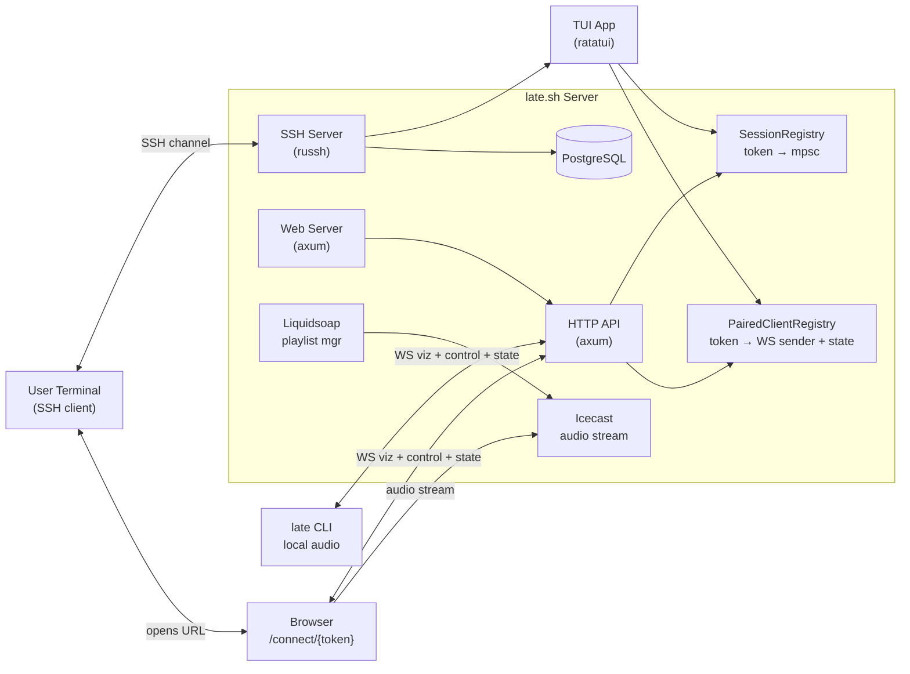
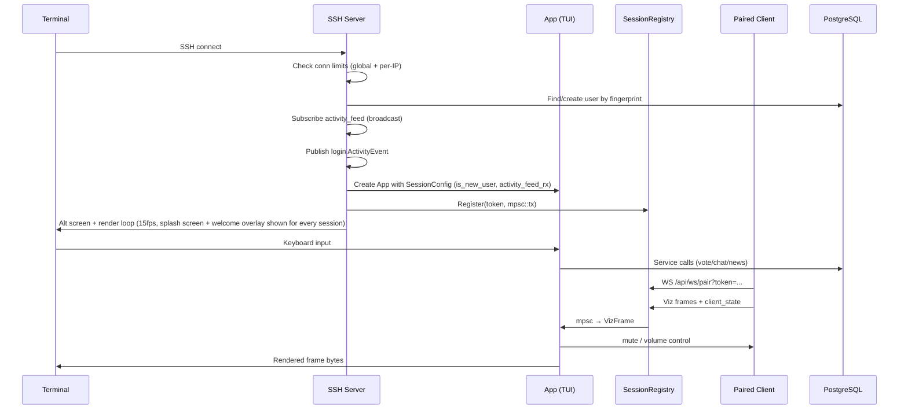
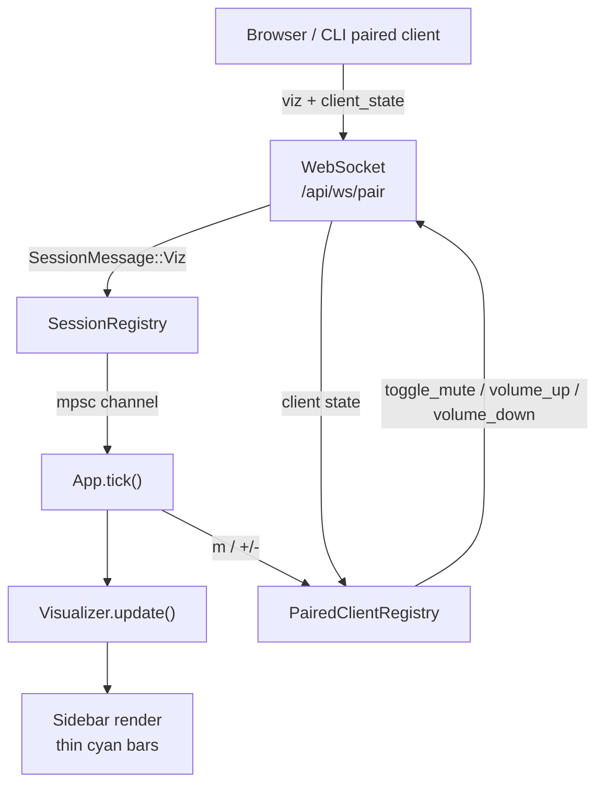
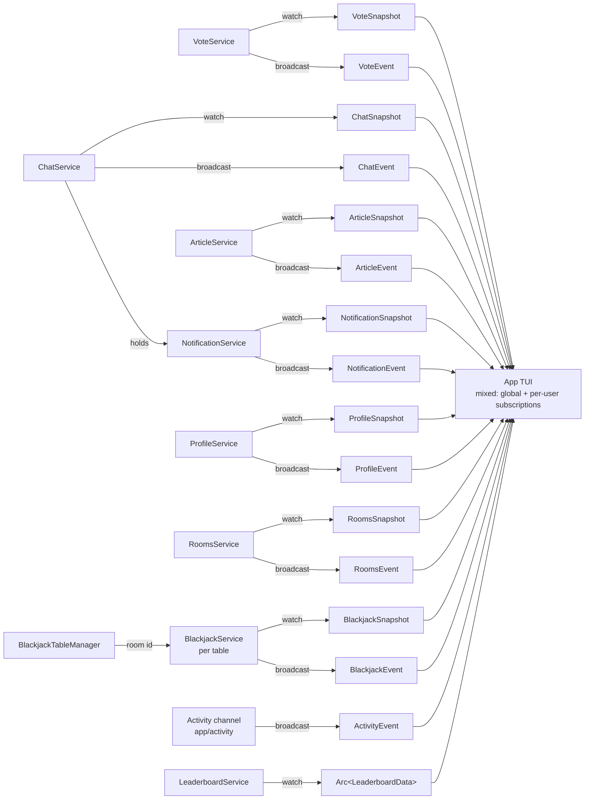
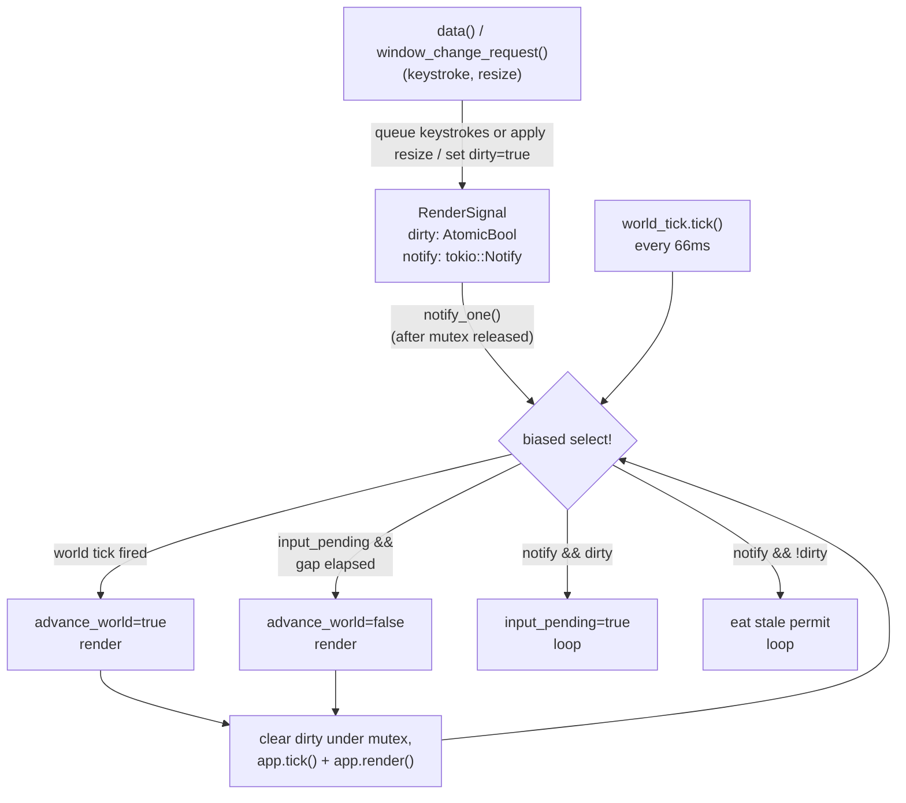
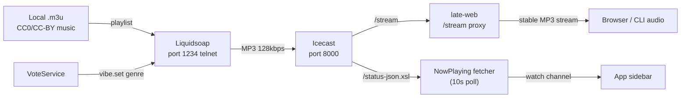

# late.sh Context

## Metadata
- Domain: late.sh - Command-Line Clubhouse for Computer People
- Primary audience: LLM agents working on this codebase, human contributors
- Last updated: 2026-06-08 (added monthly leaderboard profile awards)
- Status: Active
- Stability note: Sections marked `[STABLE]` should change rarely. Sections marked `[VOLATILE]` are expected to change often.

---

## 0. Context Maintenance Protocol (LLM-First) [STABLE]

This file is the primary working context for the entire late.sh project.

- LLM agents should treat this as a living document and update it whenever meaningful behavior changes.
- If code and this file diverge, prefer updating this file quickly so future work stays reliable.
- Temporary or branch-specific behavior should be documented here with clear cleanup notes.

### Quick update checklist
- Refresh `Last updated` date
- Review `Current Work` and `Future Work`
- Validate `Critical Invariants`
- Update telemetry references if operation/event names changed
- Remove obsolete notes
- Read `late-ssh/assets/splash_tips/new_and_returning_users_tip_pool.json` and `late-ssh/assets/splash_tips/returning_users_tip_pool.json` to keep splash tips aligned with any feature/key changes

### Freshness target
- Re-review this file regularly (every 2 weeks) to prevent context drift.

### Context Directory (Read-First Routing) [STABLE]

Use this root file as the entry point. Before changing a domain, read the matching local context file(s) below. If a task crosses domains, read every row it touches and keep root plus local docs aligned.

| Context file | Read when the task touches | What it contains |
|---|---|---|
| `CONTEXT.md` | Any task in this repo; cross-domain behavior; global contracts. | Repo architecture, test policy, service contracts, data model, telemetry, runbook, global screens/keybindings, and high-risk invariants. |
| `late-cli/CONTEXT.md` | The `late` companion binary, local audio playback, SSH launch behavior, token acquisition, pairing, installers, or CLI env/flags. | CLI architecture, native/OpenSSH/old SSH modes, identity generation, token handshake, audio decode/output/analyzer, paired-client WebSocket behavior, logging, scripts, release artifacts, and fragile CLI invariants. |
| `late-web/CONTEXT.md` | Public web pages, browser pairing/play/gallery/profiles, web route tests, templates/assets, web config, or `/stream`. | Axum app shape, routes, Askama templates, static assets, browser WebSocket protocols, audio stream proxy, gallery/profile DB contracts, web telemetry, and web-specific test placement. |
| `late-ssh/src/app/audio/CONTEXT.md` | Icecast, now-playing, YouTube queue, Music Booth, visualizer, `/audio` commands, paired audio source switching, or browser/CLI audio arbitration. | AudioService state machine, queue persistence, server-owned playback timers, fallback behavior, pair-WS audio messages, source arbitration policy, skip-vote eligibility, and cross-crate audio touchpoints in CLI/Web. |
| `late-ssh/src/app/voice/CONTEXT.md` | LiveKit voice rooms, TUI voice controls/status, CLI voice media, `/voice` browser listen-only, or pair-WS voice messages. | VoiceService token/snapshot ownership, LiveKit grants, pair-WS voice protocol, native CLI voice runtime, browser listen-only behavior, pruning/heartbeat invariants, and current voice UX gaps. |
| `late-ssh/src/app/hub/CONTEXT.md` | `Ctrl+G` Hub, Leaderboard, Quests, Shop/marketplace, cat/aquarium unlocks, chip economy presentation, or events surface work. | Hub tab ownership, leaderboard refresh, reward/economy rules, daily/weekly quest service, marketplace and entitlement projection, aquarium tray behavior, and known gaps for future events/shop work. |
| `late-ssh/src/app/bonsai_v2/CONTEXT.md` | Dynamic Bonsai branch graph, care modal, sidebar preview, growth simulation, badge scoring, or `dynamic_bonsai` shop selection. | Dynamic Bonsai persistence, renderers, input model, growth/death rules, chat badge scoring, classic Bonsai compatibility bridge, and prototype invariants. |
| `late-ssh/src/app/rooms/CONTEXT.md` | Rooms screen, persistent game-room directory, embedded room chat, room creation/deletion, room shortcuts, or multiplayer games. | Room service/persistence, active-room input/rendering, chat integration, room-game manager traits, Asterion/Blackjack/Chess/Poker/Tic-Tac-Toe/Tron runtimes, chip payouts, timers, asymmetric-info patterns, and room-game tests. |
| `late-ssh/src/app/door/CONTEXT.md` | Door Games screen, Door lobby navigation, Lateania launch/leave behavior, or active Door game key capture. | Door Games lobby-first lifecycle, active-game input capture contract, Lateania runtime boundaries, and test guidance. |
| `late-ssh/src/app/chat/CONTEXT.md` | Home chat, DMs, public/private rooms, embedded Rooms chat, composer commands, moderation, notifications, message rendering, or chat-adjacent feed services. | Chat service/state/input/UI ownership, room ordering, snapshots versus tails, message/reaction/pin/reply/edit/delete contracts, RSS/News/Mentions/Voice/Discover entries, Directory-backed Showcase/Work services, row caches, commands, and chat integration tests. |
| `late-ssh/src/app/artboard/CONTEXT.md` | Shared ASCII Artboard, dartboard code, editor input/rendering, canvas persistence, provenance, gallery snapshots, archives, or artboard bans. | Artboard lifecycle, live `dartboard_local` server, per-session editor state, active/view/archive input routing, swatches/glyph picker, provenance, persistence/archive rollovers, gallery contract, tests, and fragile layout/provenance areas. |
| `late-ssh/src/app/arcade/CONTEXT.md` | The Arcade screen, single-player games, high scores, daily puzzles, nonogram assets, Arcade rewards, or adding a new Arcade game. | Arcade lifecycle, lobby/navigation, per-game source shape, persistence/service patterns, high-score and daily puzzle categories, chip reward hooks, leaderboard integration, nonogram runtime assets, controls, and Arcade test guidance. |
| `late-ssh/src/app/games/CONTEXT.md` | Shared game primitives used by both Arcade and Rooms, especially cards or Late Chips. | Boundaries for shared card rendering and chip services; use this for common primitives only, not Arcade or Rooms runtime/UI ownership. |

Routing rules for future LLM agents:
- Update a local context file when behavior changes inside that domain.
- Update this root file when a contract is global, crosses crate/domain boundaries, changes keybindings/screens, or adds/removes a local `CONTEXT.md`.
- If code and context disagree, trust the code, then patch the relevant context before handing off.
- No local context currently exists for `late-core`, profile, classic bonsai, cat, infra, or AI modules; use this root file plus the code until one is added.

---

## 1. Summary [STABLE]

> A cozy command-line clubhouse for computer people. Chat, music, games, art, coding, and tech news. Connect with any SSH client!

`ssh late.sh` and you're in. Zero friction, terminal-first, always-on vibes.

The system is a Rust workspace with four crates (`late-cli`, `late-core`, `late-ssh`, `late-web`) backed by PostgreSQL, Icecast audio streaming, Liquidsoap playlist management, and LiveKit voice media.

- **Primary entry points:** SSH server (russh on port 2222), HTTP API (axum on port 4000), Web server (axum on port 3000), LiveKit RTC (`rtc.<domain>`)
- **Main responsibilities:** Multi-screen TUI over SSH (Home/Dashboard, The Arcade, Rooms, Door Games, Artboard, Directory), public web frontend, genre voting, paired browser/CLI audio control plus visualizer, LiveKit-backed voice room control for native `late` CLI users, real-time chat and chat-adjacent surfaces inside Home including room-scoped `/poll` polls, private per-user RSS/Atom inboxes that can be shared into News, link/YouTube sharing with AI summaries/ASCII thumbnails, Arcade games, persistent game-backed Rooms, Door Games including Lateania, a shared multi-user ASCII Artboard, a global Hub domain for leaderboard/quests/shop/events surfaces including repeatable Chat/Companion consumables and permanent monthly leaderboard profile awards, a Shop-unlocked ambient Aquarium tray toggled with `Ctrl+Q` or `Alt+A`, and one structured global Activity stream for user actions. The complete local context routing map is in `Context Directory (Read-First Routing)` above. Configurable Home layout surfaces: the global right sidebar (time, visualizer, hot rooms, bonsai, and unlockable pet companion) with on/off/custom per-screen visibility, the Home room-list rail, and lounge top boxes (always on for #lounge, optional on other Home rooms); `v` then `v` cycles persisted combinations of those panels. `c` opens the pet care modal after Pet Companion is unlocked; locked users use `Ctrl+G` to visit Hub Shop. Global `q` opens quit confirm; pressing `q` again exits and `Esc` dismisses it.
- **Highest-risk areas:** SSH render loop backpressure, connection limiting, chat sync consistency, paired-client WS routing/state drift

---

## Test Strategy [STABLE]

### Scope and intent

- Cover both runtime apps: `late-ssh` and `late-web`.
- Keep most tests close to code under change (small, deterministic, focused).
- Use integration/smoke tests for boundary behavior across crates/services.

### Strict test boundary rules (required)

**Unit tests (`#[cfg(test)] mod tests` inside `src/` files):**
- MUST be pure logic only: no database, no services, no network, no async runtime required.
- Test input/output transformations, state transitions, parsing, formatting, validation math.
- If you need a `Db`, `Service`, `State`, or any I/O — it is NOT a unit test. Move it to `tests/`.
- Good examples: `rate_limit.rs` (in-memory limiter logic), `state.rs` (enum transitions), `input.rs` (key → action mapping).
- Preferred source layout for a domain is `src/.../<domain>/mod.rs` plus adjacent `state.rs`, `input.rs`, `ui.rs`, `svc.rs` as needed. `mod.rs` files must only contain `pub mod` declarations — never `pub use` re-exports.
- Keep pure unit tests inline in those source files. Do NOT create `src/.../<domain>/tests/` folders just to split unit tests.

**Integration tests (`late-ssh/tests/`, `late-web/tests/`, `late-core/tests/`):**
- MUST use testcontainers for database access — always go through `late_core::test_utils::test_db()` (or the `helpers::new_test_db()` wrapper in `late-ssh`).
- NEVER use `Db::new(&DbConfig::default())` or hardcoded connection strings as a substitute for real DB access in integration tests.
- Exception: `late-web` route smoke tests that instantiate `AppState` but do not exercise DB-backed routes may use an inert `Db::new(&DbConfig::default())`; the moment a test hits `/gallery`, `/profiles`, or any DB code path, use `late_core::test_utils::test_db()`.
- `late-core::test_utils` owns shared test infrastructure: `test_db()`, `create_test_user()`. Use these everywhere instead of rolling per-test user creation — except in `late-core` model tests that are testing `User::create` itself.
- `late-ssh/tests/helpers/mod.rs` re-exports `create_test_user` from `late-core` and adds ssh-specific helpers (`test_config`, `test_app_state`, `make_app`, etc.). Domain test directories access these via `#[path = "../helpers/mod.rs"] mod helpers;` in their `main.rs`.
- Any test that touches DB, services, network, or cross-module orchestration belongs here.
- Preferred integration layout is domain-oriented under crate `tests/`, mirroring the source structure: `tests/<domain>/main.rs` with sibling `svc.rs`, `state.rs`, etc. as needed. `late-core` tests are named after their domain (`user.rs`, `vote.rs`, `chat/`).

**LLM enforcement:**
- On every code change, check: does this need a test? If yes, classify it strictly as unit or integration per the rules above.
- LLM agents must NOT run `cargo test`, `cargo nextest`, or `cargo clippy` in this repo. The human owner runs verification manually because those commands are too blocking in normal agent workflows.
- Do NOT put integration-flavored tests (DB calls, service interactions, spawning tasks) inside `#[cfg(test)]` module blocks in `src/` files.
- Do NOT invent extra source-side test directory structure when inline `#[cfg(test)] mod tests` is sufficient; reserve directory splits for crate-level integration tests under `tests/`.
- If a test is intentionally deferred (WIP/incomplete dependency), document the gap and cleanup plan in PR/context notes.

### Preferred test pyramid for this repo

1. Unit tests in module files — pure logic only, no I/O (`state.rs`, `input.rs`, `ui.rs`, `rate_limit.rs`).
2. Integration tests in `late-ssh/tests/` and `late-web/tests/` — real DB via testcontainers, shared helpers.
3. Workspace-wide checks before merge (`fmt`, `clippy`, `nextest`).

### Per-app guidance

For `late-ssh`:

- `app/*/state.rs`: unit tests for transition rules, event drains, selection/filter logic (includes profile field navigation).
- `app/*/input.rs`: unit tests for key routing and mode guards.
- `app/*/ui.rs`: unit tests for pure formatting/layout helpers only; avoid brittle pixel snapshots.
- `app/*/{mod,state,input,ui,svc,model}.rs`: keep the domain module flat and predictable; add pure unit tests inline in the relevant file instead of under `src/app/*/tests/`.
- `app/render.rs` / `app/tick.rs`: integration tests for orchestration (needs services/DB → goes in `tests/`).
- `app/*/svc.rs`: integration tests in `tests/<domain>/svc.rs` (needs real DB).
- Integration test directories mirror the source domain structure: `tests/<domain>/main.rs` with split files like `svc.rs`, `state.rs` as needed. Arcade game tests live under `tests/arcade/<game>.rs`.
- `ssh.rs` / `api.rs`: smoke tests in `tests/ssh_smoke.rs` / `tests/ws_smoke.rs`.

For `late-web`:

- Handler/route behavior in `late-web/tests/*` with request/response assertions.
- Page/model transformations as unit tests under `src/pages/*` (pure logic only).
- Error mapping tests in `src/error.rs` for stable status/body behavior (pure logic only).

### Command policy

- LLM agents must not run tests or lint gates locally. Do not run `cargo test`, `cargo nextest`, or `cargo clippy`; leave all verification to the human owner.
- If code changes would normally merit verification, note the expected command(s) in handoff instead of running them.
- The human owner may still use the full CI-equivalent gate locally:

```bash
make check
```

- `make check` intentionally formats/checks only first-party workspace packages (`late-cli`, `late-core`, `late-ssh`, `late-web`). Do not replace it with `cargo fmt --all`: Cargo's `--all` also formats local path dependencies, including vendored Potatis under `vendor/potatis`, whose upstream style is not rustfmt-clean in this repo.

### Known environment caveats

- Some integration/smoke tests require Docker/testcontainers and may fail in restricted sandboxes.
- Vendored Potatis integration tests that depend on upstream `test-roms/` fixtures are ignored because those ROM fixture trees are not vendored here. Keep Potatis compile/clippy coverage through `late-ssh` and its vendored unit tests, but do not make repo-level checks depend on missing upstream ROM fixtures.
- `vendor/webrtc-sys` is a repo-local `[patch.crates-io]` for `webrtc-sys` used by `late-cli` LiveKit voice. On macOS builds it defines `LIVEKIT_DISABLE_MACOS_OBJC_VIDEO_FACTORY` so audio-only CLI voice does not register LiveKit/WebRTC's ObjC video encoder/decoder factories; this avoids Tahoe/Apple Silicon `RTCVideoEncoderVP9` uncaught `NSException` crashes while keeping macOS `voice` advertised. Remove or re-evaluate this patch when upstream `webrtc-sys` fixes the ObjC VP9 path.
- If a feature area is intentionally WIP, temporary lint/test gaps are acceptable only when explicitly documented and tracked for cleanup.
- **Tool bootstrap:** The repo now includes `.mise.toml` with `rust`, `mold`, and `cargo-nextest`. Prefer `mise install` before local development so the expected toolchain and test runner are available.
- **Cargo environment setup:** For local host development, use Cargo's normal defaults, including the standard repo-local `target/` directory. Docker/dev containers still use `/app/target` via container configuration. `CARGO_HOME=$HOME/.cargo` remains a valid override when an environment needs it, but it is not a repo-wide requirement.
- **`LATE_FORCE_ADMIN=1`** — dev-only escape hatch: OR'd with `users.is_admin` at session init (`late-ssh/src/ssh.rs`), so every SSH session lands as admin. Must stay `0` in prod — enforced by `required_bool` and hardcoded to `"0"` in `infra/service-ssh.tf`.

---

## 2. Architecture (with Graphs) [STABLE]

### 2.1 Component map



### 2.2 SSH session lifecycle



### 2.3 Paired client control + visualizer flow



### 2.4 Service pub/sub model



- `VoteService` (in `app/vote/svc.rs`), `ChatService` (in `app/chat/svc.rs`), `ArticleService` (in `app/chat/news/svc.rs`), and `NotificationService` (in `app/chat/notification_svc.rs`) expose shared `watch` snapshots (`subscribe_state()` / `subscribe_snapshot()`).
- `ProfileService` (in `app/profile/svc.rs`) exposes per-user `watch` snapshots backed by service-owned maps (`subscribe_snapshot(user_id)`).
- `LeaderboardService` exposes a shared `watch::Receiver<Arc<LeaderboardData>>` refreshed from DB every 30s. Contains today's champions, daily completion statuses, extended all-time/monthly high scores (Lateris, 2048, Snake), monthly net chip-delta earners excluding shop purchases/floor restores, monthly Arcade champion points, and chip leaders (top balances). Compact Hub leaderboard panels render top rows plus calculation hints and an "around you" slice when the current user is outside the visible top list; Arcade Wins uses daily puzzle weighting (easy/draw-1 = 1, medium = 3, hard/draw-3 = 5). A companion hourly task idempotently snapshots top-5 previous-UTC-month leaderboard placements into permanent `profile_awards`; profile overview shows up to six earned awards plus `+N more`, and chat author labels show one automatic current monthly award badge.
- `ShopService` (in `app/hub/shop/svc.rs`) exposes per-user `watch::Receiver<ShopSnapshot>` values and purchase result broadcasts. It loads marketplace items, user purchases, and chip balance into a per-user snapshot at session init and after changes; render/input gates read the snapshot instead of querying DB on every keypress. It also runs a Postgres LISTEN/NOTIFY listener for `shop_user_changed`, `shop_catalog_changed`, and `chip_user_changed`, so multiple SSH replicas can refresh active users after another process changes shop or chip state.
- `QuestService` (in `app/hub/dailies/svc.rs`) exposes per-user `watch::Receiver<QuestSnapshot>` values for the Hub Quests tab. Reward templates are DB-backed in `reward_templates`; rows with `is_quest = true` are eligible for daily/weekly quest draws. Current global draws live in `quest_assignments`, per-user progress lives in `user_quest_progress`, and per-user daily streaks live in `user_daily_quest_streaks`. The service assigns one Arcade daily quest, one multiplayer room-game daily quest, and one weekly quest on UTC periods, consumes structured Activity events for progress, pays template-defined chip rewards automatically once per assignment, pays daily-streak bonuses for consecutive days where at least one daily quest is completed (+100 through +500 chips), and listens for `quest_user_changed` / `quest_assignments_changed` notifications for cross-process refresh.
- `Hub` (in `app/hub`) is the global modal opened by reserved global `Ctrl+G` except during active Artboard editing. It owns cross-product surfaces such as Leaderboard, Quests, Shop, Events, and Guide. It may summarize data from Arcade, Rooms, and economy services, but those domains keep their own runtime/service ownership; Hub-owned marketplace and entitlement projection code lives under `app/hub/shop`. Detailed Hub behavior lives in `late-ssh/src/app/hub/CONTEXT.md`.
- `ChipService` (in `app/games/chips/svc.rs`) manages the Late Chips economy: `ensure_chips(user_id)` creates new chip rows with 1000 chips, its activity reward task awards daily puzzle base chips from `reward_templates` after `GameWon` events, and reward-template payout helpers record minted game rewards in `game_payout_claims`. Chip-paying room games hold a `ChipService` clone.
- `BonsaiService` (in `app/bonsai/svc.rs`) owns tree care persistence and activity. First daily watering marks the care row and credits 200 chips through `UserChips`; watering is once per UTC day for everyone.
- `Activity` (in `app/activity`) owns the structured global user-action event type, channel helpers, and `ActivityPublisher` username lookup helper. `ActivityEvent` carries a dedupe id, `user_id`, `username`, display `action`, structured `ActivityKind`, category, and timestamp. Dashboard/sidebar display drains the same global broadcast stream through `ActivityFilter::dashboard()`. Quest-only progress signals such as score submissions and settled hand counts use `ActivityCategory::Quest`, which is intentionally hidden from the dashboard feed but consumed by `QuestService`.
- `RoomsService` (in `app/rooms/svc.rs`) owns persistent game-room creation/listing/deletion over `game_rooms` + associated `chat_rooms`, publishes `RoomsSnapshot` via `watch`, and emits `RoomsEvent` success/failure banners.
- Room-game managers/services own process-local per-room runtime state for Asterion, Blackjack, Chess, Poker, Tic-Tac-Toe, and Tron. Detailed Rooms contracts live in `late-ssh/src/app/rooms/CONTEXT.md`.
- Events remain `broadcast` for all subscribers; targeted variants carry `user_id` and are filtered in UI state.

### 2.5 TUI Rendering and State Architecture (Sync vs Async Boundary)

To maintain a buttery-smooth 15-60 FPS over SSH, the architecture strictly separates synchronous UI rendering from asynchronous business logic:

1. **The Setup (`ssh.rs` / `main.rs`)**
   When a new SSH client connects, a `SessionConfig` is built containing global *Services* (like `VoteService`, `ArticleService`, which hold DB pools and API keys).
2. **The Initialization (`app/state.rs`)**
   Inside `App::new()`, these services are used to create the *UI States* (e.g., `ChatState` which owns the `news::State` and `notifications::State`). Each UI State stores its `user_id`, subscribes to service channels, and spawns a per-user background refresh task (aborted on `Drop`).
3. **The Sync Loop (`app/tick.rs`)**
   Every 66ms, `App::tick()` runs. It calls `tick()` on all UI states. This:
   - Drains the channels to instantly update local memory state (e.g., `Vec<Article>`). User-targeted events are filtered by `self.user_id`.
4. **The Paint Job (`app/render.rs` -> `ui.rs`)**
   Immediately after the tick, `App::render()` runs. It passes the purely synchronous UI state directly to the draw functions. The UI just reads local memory and draws boxes. No `.await`, no freezing.
5. **The User Action (`app/input.rs`)**
   SSH keystrokes now first land in a per-session unbounded queue owned by the render task (`late-ssh/src/ssh.rs`). Right before each render, the task drains queued bytes into `App::handle_input()`, then runs `tick()` / `render()`. That keeps the input handler off the app mutex entirely for ordinary keystrokes while preserving the same synchronous UI state model. When an action requires I/O (like hitting `Enter` to save), the input handler fires a fire-and-forget method on the Service. The Service spawns a Tokio task to do the DB/API work, pushes the result to the channel, and the UI catches it on the next 66ms tick.

### 2.6 Render loop timing (world tick + input-driven)

Each SSH session spawns **one render task** (`late-ssh/src/ssh.rs`) with two independent trigger sources:

- **World tick** — fires every `WORLD_TICK_INTERVAL` (66ms). Advances animations (`app.tick()`), renders, ships the frame. Floor cadence ≈ 15 FPS regardless of input.
- **Input-driven render** — fires within `MIN_RENDER_GAP` (15ms) of any keystroke or terminal resize. Renders *without* advancing world time, so typed characters echo at near-native latency instead of waiting up to 66ms for the next world tick.

The select loop picks which branch to act on:



`biased` ordering ensures the world tick wins on ties so animations aren't starved under a keystroke flood. `next_render_action` is extracted as a standalone async fn so the decision logic is unit-testable without a full session.

#### Timing example — typing burst

```
t=0     world tick fires → render, previous_render=0, dirty=false
t=3     keystroke → dirty=true, notify_one (permit stored)
t=3+    select: notify branch → dirty=true → input_pending=true, continue
t=3+    select: sleep_until(0+15ms) armed, notify disabled
t=8     keystroke → dirty=true (already), notify_one (permit stored, branch disabled)
t=15    sleep_until fires → render covers BOTH keystrokes, dirty cleared
t=15+   select: notify branch eats leftover permit → dirty=false → nothing
t=66    world tick → render, animations advance
```

Two keystrokes → one render at t=15. No spurious trailing frame.

#### Why `dirty` is separate from `Notify`

`tokio::sync::Notify::notify_one()` stores **one** permit when no waiter is active. If `Notify` alone gated renders, permits left over from input already batched into an earlier render would fire an identical repeat frame one throttle window later. Two primitives, two jobs:

- `Notify` — alarm clock. Wakes the task.
- `dirty` — sticky note. Source of truth for "there is unrendered state".

The input path now sets `dirty` immediately after enqueueing bytes for the render task, without taking the app mutex. The render task clears `dirty` immediately before draining that queue under the mutex. Invariant: input that lands during a render flips `dirty` back to `true`, so the current frame may miss it, but the next loop iteration must pick it up.

The stored-permit regression is locked down by `ssh::tests::stale_permit_does_not_arm_throttle`; the surrounding tests cover throttle timing, `biased` wins, and the idle/active paths.

#### Scope and constraints

- **Throttle is per-session** — one session's flood can't affect another's cadence.
- **Ceiling: ~67 renders/sec per session** (`1000 / MIN_RENDER_GAP_MS`) — above smoothness threshold, below CPU-DoS territory.
- **Does not address lock contention** — the app mutex is still shared between `data()` and the render task; see §8.5 A. This change only closes the input-to-frame cadence gap, not the lock-held-across-tick stall.

### 2.7 Audio infrastructure

`late-ssh/src/app/audio/CONTEXT.md` owns the audio domain: Icecast house
radio, browser/CLI source arbitration, the YouTube queue + booth, visualizer
behavior, voice-room audio boundary notes, parked work, and deferred backlog.



Voice media is separate from the Icecast/Liquidsoap stack. `late-ssh` owns
voice auth/control and mints LiveKit tokens; `late-cli` owns microphone capture
and remote voice playback; LiveKit is deployed by `infra/livekit.tf` and exposed
as `rtc.<domain>`. LiveKit signaling uses HTTPS/WSS through ingress, while
ICE/TCP, ICE/UDP mux, TURN/UDP, and TURN/TLS are bound directly on the node.
Do not route voice media through the SSH render loop.

#### Music licensing strategy [VOLATILE]

The audio stack is local-playlist-only. Liquidsoap reads curated local `.m3u` playlists backed by files in `/music`, then streams the result through Icecast. There are no third-party live radio upstreams in the current design.

#### Source priority

Genres now use `mksafe(local_playlist)` only. Each playlist uses `mode="randomize"` + `loop=true` to shuffle all tracks and play through before re-shuffling, with `check_next` guards against back-to-back repeats at loop boundaries.

**Migration status (April 2026):**
- Lofi: **DONE** — 50 tracks, all CC0/CC-BY
- Ambient: **DONE** — 20 curated CC-BY 4.0 tracks
- Classical: **DONE** — 40 curated public-domain Musopen tracks
- Jazz: local-only for now; still the thinnest genre and a likely removal candidate

There are no live upstream radio sources in `radio.liq`.

#### Current local music library [VOLATILE]

Music binaries live in Cloudflare R2 (bucket configured via `MUSIC_BUCKET` GitHub var), synced to the Liquidsoap PVC at `/music/` during infra deploys by the `sync_music` job in `deploy_infra.yml`. Playlists are `.m3u` files in `infra/liquidsoap/` using Liquidsoap `annotate:` format and remain in git.

Deploy workflows (`deploy.yml`, `deploy_web.yml`, `deploy_infra.yml`, `deploy_cli.yml`) trigger on published GitHub Releases and also support manual `workflow_dispatch` with explicit `release_tag` and `environment` inputs. Shared `ci`, `build`, and `terraform` workflow calls accept `source_ref`, so manual deploys check out the requested tag instead of the UI-selected branch. Use this as the recovery path when GitHub misses a release event.

#### Music library [VOLATILE]

All music is CC0 or CC-BY licensed. CC-BY tracks require attribution — handled automatically via `annotate:` metadata in `.m3u` files flowing through ICY metadata to the sidebar "now playing" display.

Detailed track lists and source URLs live in [`MUSIC.md`](MUSIC.md).

- Lofi: done, 50 tracks, mixed `CC0` and `CC-BY 4.0`
- Ambient: done, 20 curated `CC-BY 4.0` tracks from Amarent, Ketsa, and The Imperfectionist
- Classical: done, 40 curated public-domain tracks from Musopen / Internet Archive
- Jazz: planned, source targets are HoliznaCC0, Kevin MacLeod, and Ketsa

Playlist generation uses curated manifests in `scripts/fetch_cc_music.py`, preserves `duration` in `annotate:` metadata, and can intentionally limit a playlist to the curated set even if older files still exist on disk.

#### Future music sources [VOLATILE]

**High-potential (verified CC0/CC-BY, not yet downloaded):**
- HoliznaCC0: 571 total tracks across ~50+ albums, all CC0. Full discography: https://freemusicarchive.org/music/holiznacc0/discography
- Ketsa: large catalog (lofi, jazz, soul, ambient, downtempo), CC-BY. Album "CC BY: FREE TO USE FOR ANYTHING" has 70 tracks: https://freemusicarchive.org/music/Ketsa/cc-by-free-to-use-for-anything
- John Bartmann: "Public Domain Soundtrack Music: Album One" (CC0) on Bandcamp
- Kevin MacLeod: 359 tracks (CC-BY): https://kevinmacleod.bandcamp.com/album/complete-collection-creative-commons
- FMA public domain search (9,000+ tracks): https://freemusicarchive.org/search?adv=1&music-filter-public-domain=1

**Not selected for the local library:**
- **Pixabay:** custom license, not ideal for a standalone music stream
- **Chad Crouch:** CC BY-NC + commercial licensing split
- **Blue Dot Sessions:** CC BY-NC only
- **Kai Engel:** mixed CC-BY/CC-BY-NC catalog, licensing instability after July 2025
- **Classicals.de:** license terms unclear

#### Music storage [STABLE]

Music binaries live in Cloudflare R2, synced to the Liquidsoap PVC during infra deploys (`sync_music` job in `deploy_infra.yml`). Git is the source of truth for playlists, licenses, and source URLs — not for binaries. ConfigMap changes (playlists, radio.liq, icecast.xml) trigger automatic rollouts via `config_hash` annotations on deployment templates — no explicit restart job needed.

#### Download tooling

- `scripts/fetch_cc_music.py` — Downloads from Bandcamp (via yt-dlp) and Internet Archive (via urllib), generates `.m3u` playlists with ffprobe metadata. Supports `--genre` and `--m3u-only` flags.
- Ambient uses a curated FMA manifest inside `scripts/fetch_cc_music.py` instead of the older broad-source ambient target.
- FMA CDN scrape pattern: FMA pages embed `fileUrl` in HTML as `https://files.freemusicarchive.org/storage-freemusicarchive-org/tracks/{hash}.mp3`. These are direct-downloadable without authentication. Extract with regex on the page source (see `/tmp/fetch_fma_tracks.py` for reference).
- Dependencies: `yt-dlp` (installed via pipx), `ffmpeg`, `ffprobe`, `python3`.

#### Metadata handling

Local playlist files retain full annotated metadata including duration (when present in ID3 tags). The `rewrite_np_metadata` function in `radio.liq` formats "now playing" as `Artist - Title | Duration` for the sidebar. Internet streams provided ICY metadata with no duration; local files may or may not have duration depending on the source.

### 2.8 Arcade Runtime Notes

The Arcade source domain is `late-ssh/src/app/arcade`. It owns single-player terminal games, daily puzzle state, high scores, and the Arcade lobby. Shared card/chip primitives live in `late-ssh/src/app/games`; Hub owns cross-product leaderboard surfaces. Detailed Arcade file maps, per-game controls, persistence rules, nonogram asset generation, and test guidance live in `late-ssh/src/app/arcade/CONTEXT.md`.

### 2.9 Door Games Runtime Notes

The Door Games source domain is `late-ssh/src/app/door`. It owns the top-level Door Games lobby and BBS-style persistent worlds. Screen `4` opens the Door lobby first; `Enter` launches the selected game. Lateania is currently the only Door game. With Lateania selected, `d` opens a confirmation prompt to delete the current user's saved character. Active Door games capture ordinary keys, including number keys and `q`, while `Esc` returns to the Door lobby and reserved/global modal shortcuts plus `?` remain available. Lateania character state persists to `mud_characters`; shared mob/world runtime state persists to `mud_world_states`; per-player combat targets/cooldowns/effects remain transient. Detailed lifecycle and input contracts live in `late-ssh/src/app/door/CONTEXT.md`.

### 2.10 Local CLI

`late-cli` builds the `late` companion binary. It launches the SSH TUI, plays the audio stream locally, sends visualizer frames over `/api/ws/pair`, and receives paired mute/volume controls from the TUI.

Root-level contracts:
- `late-cli` is a standalone crate with no `late-core` dependency.
- Browser and CLI share the paired-client WebSocket schema, so the TUI can show client kind plus live mute/volume state.
- Native SSH is the default launcher path. `--ssh-mode old` remains the legacy OpenSSH-through-PTY compatibility path, and `--ssh-mode openssh` is the OpenSSH-managed path for hardware-backed keys.
- Native and OpenSSH modes require server support for the `late-cli-token-v1` SSH exec handshake.
- Detailed CLI architecture, flags/env vars, audio pipeline, installer behavior, SSH modes, and fragile invariants live in `late-cli/CONTEXT.md`.

### 2.11 Artboard (Shared ASCII Canvas) [STABLE]

The Artboard is a shared, persistent, multiplayer ASCII canvas on its own top-level screen (`5`, or cycle with `Tab` / `Shift+Tab`). User-facing docs say `Artboard`; code and upstream crates still use `dartboard` heavily, so search both terms.

Detailed Artboard/dartboard behavior lives in `late-ssh/src/app/artboard/CONTEXT.md`, including lifecycle, `late-ssh/src/dartboard.rs` persistence, provenance, keybindings, archive snapshots, tests, and fragile invariants.

Root-level facts:
- The server owns one in-process `dartboard_local::ServerHandle` for the whole `late-ssh` process.
- The canonical canvas size is `384 x 192`.
- Users connect to the shared board only after opening Artboard; leaving drops that session's `LocalClient` and frees the slot.
- Artboard opens in `view` mode; `i` / `Enter` switches into active edit mode.
- Canvas and provenance are saved together in `artboard_snapshots`; special/daily/monthly archives are exposed by the read-only web gallery at `/gallery`.
- The gallery reads saved DB snapshots, not live server memory, so `main` can lag active drawing by the persistence interval.

---

## 3. File Tree (Curated) [STABLE]

```text
late-sh/
├── Cargo.toml                  # Workspace: late-cli, late-core, late-ssh, late-web
├── CONTEXT.md                  # This file
├── OPEN_README.md              # README for the public mirror repo
├── docker-compose.yml          # Dev stack: ssh, web, postgres, icecast, liquidsoap
├── Makefile / Dockerfile       # Local dev + image build entry points
├── scripts/                    # Seed helpers, local CLI runner, CLI artifact builder
├── late-core/
│   └── src/
│       ├── db.rs               # DB pool + migrations
│       ├── model.rs            # model! + user_scoped_model! macros
│       ├── models/             # Core DB-backed domain entities
│       ├── nonogram.rs         # Shared pack schema, clue derivation, daily selection
│       ├── rate_limit.rs       # Sliding-window per-IP limiter
│       └── test_utils.rs       # testcontainers DB helpers
├── late-ssh/
│   ├── src/
│   │   ├── main.rs             # Starts SSH + API + background loops
│   │   ├── ssh.rs              # russh server + render loop
│   │   ├── api.rs              # /api/* + /api/ws/pair
│   │   ├── dartboard.rs        # Shared Artboard server/persistence wrapper; see app/artboard/CONTEXT.md
│   │   ├── session.rs          # SessionRegistry + PairedClientRegistry
│   │   ├── state.rs            # Shared app state, activity, presence
│   │   └── app/
│   │       ├── ai/             # AI services: bot/graybeard + summarization
│   │       ├── arcade/         # Arcade hub + single-player game subdomains; see app/arcade/CONTEXT.md
│   │       ├── artboard/       # Shared ASCII Artboard; see app/artboard/CONTEXT.md
│   │       ├── audio/          # Audio/YouTube queue/source arbitration; see app/audio/CONTEXT.md
│   │       ├── bonsai/         # Persistent bonsai tree state, service, and UI
│   │       ├── pet/            # Persistent pet companion state, service, and UI
│   │       ├── chat/           # Chat implementation; see app/chat/CONTEXT.md
│   │       ├── dashboard/      # Landing screen layout + shortcuts
│   │       ├── games/          # Shared cards/chips primitives; see app/games/CONTEXT.md
│   │       ├── hub/            # Leaderboard, Quests, Shop, Events, Guide; see app/hub/CONTEXT.md
│   │       ├── icon_picker/    # Ctrl+] emoji + nerd font overlay (chat composer only)
│   │       ├── profile/        # Username/profile settings and stats
│   │       ├── rooms/          # Persistent game-room directory; see app/rooms/CONTEXT.md
│   │       └── vote/           # Genre vote state, service, and Liquidsoap control
│   ├── assets/nonograms/       # Prebuilt puzzle packs
│   └── tests/                  # Integration/smoke tests grouped by feature
├── late-cli/
│   ├── CONTEXT.md              # Companion CLI details: SSH modes, pairing, audio, installers
│   └── src/                    # Standalone CLI: main + config, identity, raw_mode, pty, ssh, ws, audio/{decoder,resampler,output,decoder_thread,analyzer}
├── late-web/
│   ├── CONTEXT.md              # Web routes, browser protocols, stream proxy, profiles/gallery, tests
│   ├── src/
│   │   ├── main.rs / lib.rs    # Web entrypoint + router
│   │   ├── config.rs           # Web config
│   │   ├── error.rs            # App error mapping
│   │   └── pages/              # Connect/landing, chat, gallery, play, profiles, stream, dashboard
│   └── static/                 # Tailwind output/source
└── infra/
    ├── icecast/icecast.xml     # Icecast config
    └── liquidsoap/             # Radio config + local fallback playlists
```

---

## 4. Core Contracts [STABLE]

### 4.1 Public/API contracts

**SSH API (late-ssh, port 4000):**
- `GET /api/health` - DB health check
- `GET /api/now-playing` → `NowPlayingResponse { current_track, listeners_count, started_at_ts }`
- `GET /api/status` → `StatusResponse { online, message, version }`
- `GET /api/ws/pair?token={token}` - WebSocket upgrade for paired browser/CLI control + viz

**WS payloads (client → server):**
- `{ "event": "heartbeat" }`
- `{ "event": "viz", "position_ms": u64, "bands": [f32; 8], "rms": f32 }`
- `{ "event": "client_state", "client_kind": "browser" | "cli", "ssh_mode"?: "native" | "openssh" | "old", "platform"?: "android" | "linux" | "macos" | "windows", "muted": bool, "volume_percent": u8 }`

**WS payloads (server → client):**
- `{ "event": "toggle_mute" }`
- `{ "event": "volume_up" }`
- `{ "event": "volume_down" }`

**Web routes (late-web, port 3000):**
- `GET /` - Landing page: late.sh branding, `ssh late.sh` CTA, CLI install/build copy actions, and links to gallery/play/profiles
- `GET /{token}` - Audio pairing page: WS connection to terminal session, local audio playback, paired mute/volume control, Web Audio analyzer for TUI visualizer
- `GET /status` - HTMX fragment: now-playing track + listener count for the landing footer. Polled every 5s.
- `GET /pair/status` - HTMX fragment: now-playing track + artist + listener count for the audio pairing page. Polled every 5s.
- `GET /dashboard`, `/dashboard/now-playing`, `/dashboard/status` - Internal/demo dashboard and HTMX partials
- `GET /gallery?key=...` - Read-only Artboard snapshot gallery backed by saved DB snapshots
- `GET /play`, `/play/listeners` - Browser xterm.js TUI demo through `late-ssh` `/api/ws/tunnel`
- `GET /profiles`, `/profiles/{slug}` - Public work profile index/detail pages
- `GET /stream` - `audio/mpeg` stream proxy to Icecast with bundled silence fallback
- `GET /test` - Error simulation endpoint
- All other routes → redirect to `/`
- Detailed web route, template, runtime config, browser protocol, and stream-proxy notes live in `late-web/CONTEXT.md`.

**Service stream contracts (internal):**
- `VoteService::subscribe_state()` (in `app::vote::svc`) → shared `watch::Receiver<VoteSnapshot>` (durable latest state)
- Chat service/news/notifications/showcase/work stream contracts live in `late-ssh/src/app/chat/CONTEXT.md`.
- `ProfileService::subscribe_snapshot(user_id)` → per-user `watch::Receiver<...Snapshot>` (durable latest state)
- `ProfileService::prune_user_snapshot_channel(user_id)` → explicit cleanup hook called from UI state `Drop`; removes idle per-user snapshot senders
- `LeaderboardService::subscribe()` → `watch::Receiver<Arc<LeaderboardData>>` (shared, refreshed every 30s from DB; contains today's champions, daily completion statuses, monthly Arcade champion points, high scores, and chip boards)
- `subscribe_events() → broadcast::Receiver<...Event>` - transient events/notices

### 4.2 Auth and scope model

- **Identity:** First unknown SSH key creates a user instantly. `user_ssh_keys` maps many fingerprints to one user. Settings > Account supports destructive account linking by moving the losing account's SSH keys to the chosen main account; no user data is merged.
- **Open access:** `LATE_SSH_OPEN=true` enables auth, but only public-key auth is accepted; password and keyboard-interactive are always rejected
- **User scoping:** Votes are scoped to `user_id` (FK to `users.id`)
- **Chat scoping:** Rooms visible via membership (`ChatRoom::list_for_user`, `ChatRoomMember`)
- **Auto-join:** Public rooms with `auto_join=true` are seeded for a user only when the user record is first created; reconnecting does not re-add rooms the user already left. The regular `/public #room` user command creates/opens an opt-in room only for the caller (`auto_join=false`, no bulk member add). Permanent/admin room creation still bulk-adds all existing users when the room is created/promoted.
- **Multi-tenant isolation:** All user data queries filter by `user_id`; no cross-user reads

### 4.3 Data model and key enums

**Entities (all use UUID v7 PKs, `id`/`created`/`updated` built into `model!` macro, lists default to `ORDER BY created DESC`):**

| Entity | Table | Key constraints |
|--------|-------|----------------|
| User | `users` | `fingerprint` UNIQUE; `is_admin` and `is_moderator` role flags; `username` trimmed length 1-32, case-insensitive UNIQUE via `idx_users_username_lower`, format `^[A-Za-z0-9._-]+$` and no `@` (canonical public handle); `settings` JSONB holds `ignored_user_ids: [uuid]` (keyed by id, not username, so renames don't drop ignores), `theme_id` (string), `enable_background_color` (bool), `show_right_sidebar` (bool, default-on when absent), `show_room_list_sidebar` (bool, default-on when absent), `favorite_room_ids: [uuid]` (ordered room pins toggled from Home with `f`, not edited in Settings), `show_dashboard_header` (bool, default-on when absent; controls top boxes on non-lounge Home rooms only; #lounge always shows them), `notify_kinds: [text]` (desktop-notification opt-ins: `dms`, `mentions`, `game_events`), `notify_cooldown_mins` (int >= 0; 0 = no throttle) |
| UserSshKey | `user_ssh_keys` | `fingerprint` UNIQUE; many SSH key fingerprints may point to one `users.id`; account linking moves rows from the abandoned user to the kept user before deleting the abandoned user |
| AccountLinkCode | `account_link_codes` | Short post-login link codes, `code` UNIQUE, per-user expiry and `consumed_at`; used only from Settings > Account between already-created accounts |
| Vote | `votes` | `user_id` UNIQUE (one vote per user per round) |
| ChatRoom | `chat_rooms` | `kind` IN (lounge, language, dm, topic, game), complex constraints |
| ChatRoomMember | `chat_room_members` | PK `(room_id, user_id)`, `last_read_at` |
| ChatMessage | `chat_messages` | `body` 1-2000 chars, nullable `reply_to_message_id` self-FK for reply jumps |
| Article | `articles` | `url` UNIQUE, `user_id` FK |
| ArticleFeedRead | `article_feed_reads` | `user_id` PK/FK, per-user news read checkpoint |
| Notification | `notifications` | `user_id`+`actor_id` FK to users, `message_id` FK to chat_messages, `room_id` FK to chat_rooms, `read_at` nullable, CHECK(user_id<>actor_id) |
| SudokuDailyWin | `sudoku_daily_wins` | `UNIQUE(user_id, difficulty_key, puzzle_date)`, score tracked |
| NonogramDailyWin | `nonogram_daily_wins` | `UNIQUE(user_id, difficulty_key, puzzle_date)`, binary completion |
| MinesweeperGame | `minesweeper_games` | `UNIQUE(user_id, difficulty_key, mode)`, stores seeded mine_map + player_grid + lives (3-life system) |
| MinesweeperDailyWin | `minesweeper_daily_wins` | `UNIQUE(user_id, difficulty_key, puzzle_date)`, best score (lives remaining) retained |
| SolitaireGame | `solitaire_games` | `UNIQUE(user_id, difficulty_key, mode)`, stores seeded stock/waste/foundations/tableau |
| SolitaireDailyWin | `solitaire_daily_wins` | `UNIQUE(user_id, difficulty_key, puzzle_date)`, best score retained |
| BonsaiTree | `bonsai_trees` | `user_id` UNIQUE, growth_points, last_watered DATE, seed BIGINT, is_alive BOOLEAN |
| BonsaiGrave | `bonsai_graveyard` | `user_id` FK (not unique — multiple deaths), survived_days, died_at |
| BonsaiDailyCare | `bonsai_daily_care` | `UNIQUE(user_id, care_date)`, UTC daily care row with watered flag, generated branch goal, cut branch ids, and one-shot water/prune penalty flags |
| GamePayoutClaim | `game_payout_claims` | `UNIQUE(user_id, game, payout_kind, period_kind, period_key)`, reusable chip-payout claim rows; Asterion escape uses `period_kind=utc_day`, while Chess/Tron wins use `period_kind=cooldown` for DB-backed per-player reward cooldowns |
| PetCompanion | `pet_companions` | `user_id` UNIQUE, nullable `last_fed`/`last_watered`/`last_played` plus `last_treated` timestamp, `species` (`cat`/`dog`), and `care_streak_days`/`care_streak_date`; SSH pet care uses food every two days, daily water, and a chase-toy play session. Bought Pet Food can be used once per UTC day to pet the companion and start a one-hour session-local roam. Mood is weighted: food hurts most, missing water/play is softer, and `Happy` requires all needs met for a 3-day completed-care streak; pets never die. |
| UserChips | `user_chips` | `user_id` PK/FK, `balance` BIGINT (new users start at 1000; busted-player floor restore is 100), `last_stipend_date` DATE |
| MarketplaceItem | `marketplace_items` | `sku` UNIQUE, curated Hub Shop item metadata, `item_kind`, optional `slot`, chip price, JSONB payload, active/time-window visibility fields, and sort order |
| UserPurchase | `user_purchases` | durable per-user ownership of marketplace items, `UNIQUE(user_id, item_id)`, optional equip slot, quantity/remaining uses, and captured purchase price |
| Showcase | `showcases` | `user_id` FK; `title` 1-120, `url` 1-2000, `description` 1-800, `tags` TEXT[] (lowercased, ≤8). Listed newest-first, edit/delete restricted to author or admin |
| ShowcaseFeedRead | `showcase_feed_reads` | `user_id` PK/FK, `last_read_at` timestamp cursor for per-user Showcase unread counts |
| WorkProfile | `work_profiles` | `user_id` UNIQUE FK; `slug` UNIQUE (`w_` + 12 lowercase alnum), `headline`, status (`open`, `casual`, `not-looking`), type/location, links, skills, summary. Listed latest-update-first, edit/delete restricted to author or admin |
| WorkFeedRead | `work_feed_reads` | `user_id` PK/FK, `last_read_at` timestamp cursor for per-user Work unread counts |
| GameRoom | `game_rooms` | Generic game-room registry. `id` UUIDv7, `chat_room_id` UNIQUE FK to `chat_rooms`, `game_kind` TEXT, `slug` UNIQUE, `display_name` non-empty, `status` IN (`open`, `in_round`, `paused`, `closed`), `settings` JSONB, optional `created_by`. `GameKind` is a Rust enum over text, not a Postgres enum. |
| ArtboardSnapshot | `artboard_snapshots` | `board_key` UNIQUE (`main`, `special:YYYY-MM-DD`, `daily:YYYY-MM-DD`, `monthly:YYYY-MM`), `canvas` JSONB, `provenance` JSONB. Runtime contracts live in `late-ssh/src/app/artboard/CONTEXT.md`. |

**Key enums:**
- `Genre`: `Lofi`, `Classic`, `Ambient`, `Jazz` (vote/service/liquidsoap)
- `Screen`: `Dashboard`, `Arcade`, `Rooms`, `DoorGames`, `Artboard`, `Pinstar` (screen 6 renders as Directory: Profiles, Projects, and Pinstar tabs). `Dashboard` is rendered as Home and owns the chat room rail/center. News, Mentions, RSS, Voice, and Discover are synthetic room-like entries within Home chat. Showcase/Projects and Work/Profiles data still use chat-adjacent services and unread cursors, but their UI lives on Directory page 6, not the Home rail or room jump picker.
- `ChatRoom.kind`: `lounge` (slug=lounge), `language` (slug=lang-{code}), `topic` (user/admin created), `dm` (canonical user pair), `game` (Rooms-backed embedded chat)
- `ChatRoom.visibility`: `public`, `private`, `dm`
- `GameKind`: Rust enum in `late-core::models::game_room`; currently `Asterion`, `Blackjack`, `Chess`, `Poker`, `TicTacToe`, and `Tron`. Persisted as `TEXT` in Postgres to keep future game-kind changes/migrations simple.

### 4.4 Error model

- **Service errors:** Propagated via `anyhow::Result`, surfaced as `VoteEvent` / `ChatEvent` error variants
- **Chat:** `SendSucceeded` / `SendFailed` with `request_id` for composer feedback
- **Votes:** `VoteEvent::Error { user_id, message }` for unknown user
- **SSH:** Connection rejected on limit exceeded; render frame drops logged
- **Web:** `AppError::Internal` / `AppError::Render` → HTTP 500 with template fallback

---

## 5. Telemetry and Observability [STABLE]

- **Architecture:** 100% native OpenTelemetry (OTLP) pipeline powered by `opentelemetry` and `tracing` crates, routed through an OpenTelemetry Collector into a pure VictoriaMetrics backend.
- **Traces (`VictoriaTraces`):** Distributed tracing spans generated via `#[tracing::instrument]`. The Collector automatically generates RED metrics (Rate, Errors, Duration) from these spans using the `spanmetrics` connector.
- **Service graph requirement:** VictoriaTraces must run with `--servicegraph.enableTask=true` for the Grafana service graph / dependencies view to populate from trace relationships.
- **Logs (`VictoriaLogs`):** Structured JSON logs bypassing stdout completely via `opentelemetry-appender-tracing`. Trace IDs and Span IDs are natively embedded for full cross-correlation in Grafana.
- **Metrics (`VictoriaMetrics`):** Custom metrics (e.g., counters) pushed directly via OTLP PeriodicReader, alongside the RED metrics generated by the Collector.
- **HTTP server spans:** `late-web` wraps the router with request middleware that emits `otel.kind=server` spans and records `http.request.method`, `http.route`, `url.path`, and `http.response.status_code`; 5xx responses set `otel.status_code=ERROR`.
- **Trace propagation:** `late-core::telemetry::init_telemetry()` installs the W3C Trace Context propagator. `late-web` injects trace headers on outbound `/api/now-playing` requests, and `late-ssh` extracts incoming headers on API requests so cross-service traces can form real parent/child relationships.
- **Web metrics:** `late_web_page_views_total{page,has_token}` and `late_web_now_playing_fetch_total{result}` are emitted when `late-web` is built with the optional `otel` feature; metrics are no-ops without it.
- **Grafana provisioning invariant:** The metrics datasource uses the stable UID `victoriametrics`; provisioned dashboards must reference that UID instead of Grafana-generated datasource IDs.
- **Console Output:** Local dev uses `tracing_subscriber::fmt` with `RUST_LOG=info,late_web=debug,late_ssh=debug,late_core=debug`.
- **DB health:** `GET /api/health` endpoint, `Db::health()` method
- **Connection counts:** Per-IP tracking in `State.conn_counts`, global via semaphore. When `LATE_SSH_PROXY_PROTOCOL=true`, SSH per-IP limits use the client IP from PROXY protocol.
- **Presence/listener count source:** TUI sidebar online/users and `/api/now-playing.listeners_count` both use `State.active_users`.
- **Username display source:** `State.username_directory` is the app-wide `Uuid -> username` map for plain display labels. It is loaded from `users` at startup, refreshed from DB every 30 minutes, and updated on SSH/web login, profile save, mod rename, and account delete. Render paths merge chat-known names with this directory and let the directory win, so room-game seats and Home recent joins must not depend on a user having spoken in chat.

---

## 6. Current Work [VOLATILE]

In progress:
- **Rooms/Blackjack:** Active multiplayer table-game work is documented in `late-ssh/src/app/rooms/CONTEXT.md`. Root context keeps only project-wide contracts; local context owns directory, service, Blackjack runtime, rendering, dashboard slot, and known-gap details.

Future:
- **Nonograms (v2)**: Replace random generation with pixel-art-to-nonogram pipeline or bulk-curate from webpbn.com.
---

## 7. Future Work & Roadmap [VOLATILE]

1. Chat upgrades: better backlog pagination, moderation polish, and richer matchmaking hooks

Known gaps/risks:
- Online/listener metrics are app-level presence (`active_users`, includes @bot and @graybeard), not true Icecast listener analytics
- Time remaining is approximate (up to 5s polling delay on track change)
- No external metrics or alerting system
- **Single-replica assumption:** Several structures are purely in-memory and not shared across processes (see multi-replica notes below)
- **SSH pod drain window:** `infra/service-ssh.tf` sets `termination_grace_period_seconds = 21600` (6h) so rolling updates can stop new connections while allowing existing SSH sessions to drain for a long window before Kubernetes sends SIGKILL.
- **SSH ingress reload risk:** `ssh late.sh` currently reaches `late-ssh` through RKE2 ingress-nginx TCP passthrough (`infra/ssh-tcp.tf`, port `22 -> service-ssh-sv:2222::PROXY`). Long-lived SSH sessions can be dropped after any ingress-nginx config reload because old workers are terminated after `worker_shutdown_timeout` (observed 2026-04-29 after cert-manager renewed `service-web-tls`: reload at `19:56:37Z`, mass SSH/WS disconnect at `20:00:38Z`, matching the 240s timeout). Future infra improvement: stop routing SSH through ingress-nginx; use a dedicated TCP LoadBalancer/NodePort/host proxy for SSH so HTTP/TLS reloads cannot kill SSH sessions. Short-term mitigation: increase ingress-nginx `worker-shutdown-timeout`, but that only delays the disconnect.
- **Postgres primary CPU saturation from discover-room fanout:** Observed 2026-05-14 in Kubernetes: CNPG primary `postgres-1` was healthy but pinned near its `1` CPU limit, while the node still had spare CPU. `pg_stat_activity` showed `service-ssh` (`10.42.0.47`) running 8 concurrent `app` sessions on the same public topic-room discover query. The old query joined `chat_rooms -> chat_room_members -> chat_messages` and then used `COUNT(DISTINCT ...)`, producing an estimated ~4.48M joined rows before aggregation. Preferred fix is query shape first: aggregate member/message counts separately (current `ChatRoom::list_discover_public_topic_rooms` uses `LATERAL` aggregates), then raise the CNPG CPU limit from `1` to `2` only for headroom. Secondary log noise during the same check: repeated `idx_users_username_lower` duplicate-key errors from profile updates; do not mistake those for the main CPU source unless active queries point there.
- **IPv6 ingress status:** RKE2/CNI `hostPort` exposes the current ingress-nginx path for IPv4 only; do not switch the main ingress controller to `hostNetwork` without a rollout plan. Public IPv6 is handled by the separate `kube-system/ipv6-proxy` HAProxy DaemonSet in `infra/ipv6-proxy.tf`, binding `2a01:4f9:c013:2ae1::1` on `80`, `443`, and `22`; HTTP(S) forwards to localhost ingress hostPorts, while SSH forwards to `service-ssh-sv:2222` with PROXY protocol. Verified working externally on 2026-05-03; `Network is unreachable` during `ssh -6 late.sh` means the client lacks IPv6 egress.
- **Stateful VT parsing in `late-ssh/src/app/input.rs`:** SSH input now runs through a persistent `vte::Parser`, so CSI/SS3 sequences and bracketed paste survive split russh reads instead of assuming the whole escape sequence lands in one chunk. That removes the old split-paste failure where `[200~` / `[201~` residue or embedded newlines could leak through as live keystrokes. The app still keeps two pragmatic layers on top: `is_likely_paste` heuristically treats large printable unmarked chunks as paste for terminals without bracketed paste, and `sanitize_paste_markers`/`strip_paste_markers` still scrub stored residue defensively when copying URLs from older polluted state. Standalone `Esc` is resolved on a short tick delay so split escape sequences are not mistaken for cancel keys.

Roadmap ideas:
1. Nail one addictive loop: join -> listen -> chat -> vote -> return tomorrow.
2. Pick a clear ICP first: solo devs at night vs remote teams during work hours.
3. ~~Add one "reason to come back" mechanic~~ ✓ Daily puzzle wins, chips, and leaderboard. Next: daily room rituals, timed events.
4. Keep friction near zero: ssh late.sh + optional browser pairing only when wanted.
5. Measure retention early: D1/D7 return, session length, messages/user, votes/session.

### Arcade And Game Roadmap [VOLATILE]

Arcade runtime, shipped game categories, detailed controls, chips, leaderboards, daily puzzle wins, and nonogram generation notes live in `late-ssh/src/app/arcade/CONTEXT.md`. Persistent multiplayer room-game details live in `late-ssh/src/app/rooms/CONTEXT.md`.

Product-level roadmap ideas that cross domains:
- Monthly chip leaderboard resets and hall-of-fame surfaces.
- Strategy multiplayer such as Chess or Battleship with W/L or rating.
- Chat-based matchmaking through `/play <game>` or `/challenge @user <game>`.

### Persistent Multiplayer World (Big Bet) [VOLATILE]

An always-running game where every connected SSH session is automatically a participant. The world ticks forward whether you're watching or not — drop in, make moves, drop out, come back tomorrow.

**Direction:** 4X / trading / economy game. Think simplified space traders or terminal-scale Civilization — explore, expand, exploit, trade. Every connected user is a player in the same persistent world.

**Why it fits late.sh:**
- Always-on matches the clubhouse vibe — the world is alive when you SSH in
- Scales naturally with player count (more players = richer economy/politics)
- Gives a strong "check back tomorrow" retention loop
- Integrates with Late Chips economy
- Chat becomes strategic (alliances, trade negotiation, trash talk)

**Open design questions:**
- Turn-based (ticks every N minutes) vs real-time with rate-limited actions?
- How much can happen while you're offline? (auto-trade, passive income, vulnerability to raids?)
- Map topology: shared grid, star map, abstract network?
- Win conditions or endless sandbox?

### Bonsai Tree Enhancements
- Seasonal color shifts (real-world date), profile display for visitors, graveyard rendering on profile.
- Fancier renderer — possibly port/adapt `cbonsai` (https://github.com/mhzawadi/homebrew-cbonsai) for richer growth animation and branching.

### GitHub Notifications Widget
- Read-only dashboard widget showing PR reviews, mentions, issue updates via PAT.
- Gives solo devs a productivity reason to keep the terminal open.

### Other Ideas
- Daily/weekly rituals (lo-fi standup, shipped rollup, weekend recap)
- Ambient presence (quiet hours, listening since, typing indicator)
- Micro-collab tools (shared scratchpad, snippet paste, pairing ping)
- Cozy utilities (pomodoro, focus playlists, now-playing shoutouts)
- Community texture (rotating shoutout board, wall of thanks)
- Events (coffee breaks, AMAs, mini coding jams)
- Personalization (accent color, favorite vibe, custom tagline)

### Chat implementation

Chat-specific refresh/tail loading, commands, rendering, keybindings, synthetic entries, performance notes, and gotchas live in `late-ssh/src/app/chat/CONTEXT.md`.

### Multi-replica readiness (future)

Currently the SSH app assumes a single process. These in-memory structures would need to be externalized (Redis / Postgres) for multiple replicas:

| Structure | Location | Current | To externalize |
|-----------|----------|---------|----------------|
| `current_genre` / `round_id` | `VoteService::ServiceState` | In-memory, resets to Lofi on restart | Persist to DB; only one replica runs the switch timer (leader election or DB lock). During pod drain today, the old pod cancels the vote loop immediately so only the new pod keeps mutating rounds/Liquidsoap. |
| `active_users` / `conn_counts` | `State` | In-memory counters | Shared store (Redis or DB) |
| `SessionRegistry` | `session.rs` | In-memory `token → mpsc` | Stays local — sticky sessions route SSH + WS to same replica |
| Vote/Chat/Article events + snapshots, Profile per-user snapshots | `broadcast` / `watch` channels | In-process only | Postgres `LISTEN/NOTIFY` or Redis pub/sub for cross-replica fan-out |
| @bot + @graybeard chat | `GhostService` | Always-on presence + AI chat tasks; both are dedicated DB users with fixed fingerprints | Single-leader to avoid duplicate chat responses. During pod drain today, the old pod cancels bot tasks immediately. |
| Leaderboard data | `LeaderboardService` | DB-backed `watch` channel, 30s refresh | Already DB-backed; each replica runs its own refresh loop — duplicate work but no write conflict |

**Approach:** Sticky sessions (LB routes by source IP) so each SSH connection lives on one replica. Shared data via DB/Redis. Not needed yet — single replica handles thousands of concurrent SSH sessions.

---

## 8. Critical Invariants and Tricky Flows [STABLE]

### 8.1 Security/scoping invariants

- All user-data queries MUST filter by `user_id` - enforced by `user_scoped_model!` macro and explicit `_by_user` method variants
- Application SQL belongs in `late-core` models/migrations. `late-ssh` and `late-web` should call typed model/service methods rather than embedding SQL strings.
- `model!` macro hardcodes `id: Uuid`, `created: DateTime<Utc>`, `updated: DateTime<Utc>` — do NOT duplicate these in `@generated`; use `@generated` only for extra fields (e.g., `last_seen` on User)
- Chat room visibility enforced via `ChatRoom::list_for_user` (membership join) - never expose rooms user hasn't joined
- `#announcements` is read-joinable like other permanent public rooms, but only admins may post there; enforce this in the chat service send path, not only in the UI
- DM rooms canonicalize user IDs (`dm_user_a < dm_user_b` text order) to prevent duplicate DM pairs
- DM room endpoints (`dm_user_a`, `dm_user_b`) are durable even when `chat_room_members` changes: if one participant leaves a DM, the next message from the other participant re-adds both endpoints before targeted delivery. Private topic rooms do not have durable endpoints and still require explicit invites/rejoins.
- `users.username` is the canonical public handle for chat/DM lookup; SSH login seeds it from the SSH username via `User::next_available_username` (sanitizes to `[A-Za-z0-9._-]`, adds `-N` suffixes to stay unique on `LOWER(username)`)
- Plain username display should use `State.username_directory` or the render snapshot derived from it. Do not add ad hoc per-feature username caches for seat labels, activity labels, or recent-join labels unless the feature needs richer author metadata such as badges, countries, or bonsai glyphs.
- @bot and @graybeard bootstrap on app startup: ensure DB user with a fixed `username`, join public rooms, and insert into `active_users` (always online). Both are dedicated users with fixed fingerprints (`bot-fp-000`, `graybeard-fp-000`)
- Connection limits (global semaphore + per-IP counter) plus SSH attempt rate limit (sliding window) MUST be enforced before any auth (effective client IP is resolved from PROXY protocol when enabled)
- Chat message deletes are hard deletes; any moderation/delete path must remove rows directly rather than relying on tombstones

### 8.2 Data integrity invariants

- UUID v7 PKs (`uuidv7()` default) for time-ordered IDs across all tables
- All foreign keys use `ON DELETE CASCADE` - deleting a user cascades to all their data
- Vote table has `UNIQUE(user_id)` - one vote per user, upsert on conflict
- Chat room constraints: lounge must have `slug='lounge'`, language must have `language_code`, DM must have both user IDs with correct ordering
- `auto_join` can only be `true` for public rooms

### 8.3 High-risk end-to-end flows

**Paired client control + visualizer:**
1. Trigger: SSH PTY request creates a session token plus the inbound `SessionRegistry` route.
2. Processing: Browser or CLI connects `GET /api/ws/pair?token=...`; API registers an outbound paired-client sender/state slot in `PairedClientRegistry`.
3. Side effects: Paired client sends viz frames (66ms-ish) plus `client_state`; viz frames route through `SessionRegistry` to `App.tick()`, while `client_state` updates paired kind/mute/volume metadata in `PairedClientRegistry`.
4. Side effects: TUI `m`, `+`, and `-` send `toggle_mute`, `volume_up`, and `volume_down` back over the same WS to only the paired client for that token.
5. Failure: If the paired client disconnects, visualizer decays (rms * 0.96 per tick) and paired state disappears. If SSH disconnects, the session token unregisters on drop.

**Chat flows:**
Chat send/edit/delete, ignore, roster/help overlays, replies, Home room favorites, autocomplete, synthetic entries, and chat rendering flows live in `late-ssh/src/app/chat/CONTEXT.md`.

**Vote round switch:**
1. Trigger: VoteService background tick (5s) detects switch interval (default 60 min) elapsed since last switch
2. Processing: `switch_to_winner()` → pick genre with most votes (or keep current) → clear all votes → increment `round_id` → send `vibe.set <genre>` to Liquidsoap
3. Side effects: All clients detect `round_id` change → clear `my_vote`. Liquidsoap switches playlist.
4. UI: `VoteSnapshot::remaining_until_switch()` derives a live countdown from `next_switch_in` and `updated_at`; the right sidebar vibe/vote line renders when the current vote round ends.
5. Failure: Liquidsoap TCP failure logged but round still switches locally.

### 8.4 Easy-to-break gotchas

- **Rooms/Blackjack invariants live locally:** directory filters/placeholders, Blackjack render tiers, service-owned stake chips, seat player hydration, room-game seat events, dashboard featured-room box, and active-room chat routing are documented in `late-ssh/src/app/rooms/CONTEXT.md`.
- **Chat invariants live locally:** room ordering, composer targets, replies, reactions, pins, ignores, snapshots/tails, row caches, synthetic entries, and chat keybindings are documented in `late-ssh/src/app/chat/CONTEXT.md`.
- **Artboard invariants live locally:** dartboard lifecycle, persistence/archives, provenance, active-vs-view input routing, swatches, glyph picker, and gallery lag caveats are documented in `late-ssh/src/app/artboard/CONTEXT.md`.
- **Render loop missed ticks:** 66ms interval with `MissedTickBehavior::Skip` - if a frame takes too long, next ticks are skipped rather than queued (prevents snowball lag)
- **SSH data timeout:** `handle.data` has 50ms timeout to avoid blocking render loop on backpressure
- **SSH send failure is terminal for render task:** if `handle.data` returns `Err` (closed/broken channel), `render_once` now returns an error so the render loop stops and closes channel once, instead of logging warnings every 66ms forever
- **All services are singletons** shared across SSH sessions. `ProfileService` snapshots are per-user channels keyed by `user_id`; events still require `user_id` filtering in UI state. Profile snapshots include the `Profile` projection plus a read-only `bonsai_trees` row when one exists, so viewing a profile can render bonsai without creating/mutating another user's tree. Per-user background refresh tasks are spawned on session init and aborted on `Drop`, and profile snapshot channels are pruned when receivers go away.
- **Web Audio `createMediaElementSource` is one-shot:** Can only be called once per `<audio>` element. AudioContext + source node must be created once and reused across play/pause cycles. Disconnect suspends the context (`audioCtx.suspend()`), replay resumes it — never close and recreate.
- **Browser audio pairing status must not be stomped by WS:** WS `onclose`/`onerror` must check `status !== 'playing'` before setting `'disconnected'`, otherwise a WS drop kills the "streaming" UI while audio is still playing fine
- **Paired-client control routing is latest-wins per token:** `PairedClientRegistry` stores one outbound sender/state entry per session token. If multiple browser/CLI clients pair against the same token, the most recent registration owns control/state until it disconnects.
- **Web/CLI Audio and WS Resiliency:** Both paired clients use bounded retry loops for WebSocket disconnections and audio stream failures. Web Audio reconstructs elements with cache-busting `?t=` URLs, and CLI stream/audio specifics live in `late-cli/CONTEXT.md`.
- **Browser and CLI viz payloads share schema, not implementation:** Both paired clients send `{ event: "viz", position_ms, bands, rms }`, but the browser uses Web Audio `AnalyserNode` while the CLI uses an in-process Rust FFT over playback samples. Expect similar behavior, not identical numbers.
- **CLI invariants live locally:** SSH modes, token handshakes, identity generation, local audio pipeline, terminal resize forwarding, and pre-token input gating are documented in `late-cli/CONTEXT.md`.
- **Activity feed broadcast timing:** `broadcast::Receiver` only sees messages sent AFTER subscription. The receiver must be created in `auth_publickey` (before login event is sent), stored on `ClientHandler`, then `.take()`'d into `SessionConfig` in `pty_request`. Creating the receiver later misses the user's own login event.
- **Leaderboard refresh is async:** `LeaderboardService` refreshes every 30s. Activity feed callouts are immediate, but leaderboard surfaces can lag until the next refresh. Arcade-specific daily-win details live in `late-ssh/src/app/arcade/CONTEXT.md`.
- **Game services publish Activity wins:** Arcade daily services and room-backed games publish structured `ActivityEvent::game_won(...)` callouts. Room-game details live in `late-ssh/src/app/rooms/CONTEXT.md`; Arcade details live in `late-ssh/src/app/arcade/CONTEXT.md`.
- **Bonsai death check runs on login:** `BonsaiService::ensure_tree()` checks `last_watered` against UTC today on every SSH session start. If 7+ days have passed, the tree is killed and a graveyard record is created. This means death is only detected when the user reconnects, not while offline.
- **Bonsai daily care is UTC-based:** session startup ensures today's `bonsai_daily_care` row and applies unapplied penalties from prior care rows once. Missing water does not directly reduce growth, but 7+ dry days kills the tree. Missing the generated daily wrong-branch cuts costs 10 growth. The global `w` opens the care modal; watering now happens inside that modal.
- **Bonsai passive growth is per-session:** The tick counter in `BonsaiState` grants 1 growth point every ~9000 ticks (~10 min at 15fps). If a user has multiple sessions, each grants growth independently. This is acceptable — it rewards being connected, not gaming the system.
- **Chat username badge order:** Chat author labels render special allowlist badges first (`mod`, `developer`, `artist` order), then the bonsai stage glyph, one automatic current monthly leaderboard award badge, equipped chat-shop badge, equipped flag, and finally the `/brb` moon when any active session for that user is away. Bonsai metadata loads each visible author's state and maps stages as Seed `·`, Sprout `⚘`, Sapling `🌱`, Young `🌲`, Mature `🌳`, Ancient `🌸`, Blossom `🌼`; Dead renders no glyph.
- **Bonsai growth stages:** living stages use a simple 100-point ladder capped at 700 growth points: Seed 0-99, Sprout 100-199, Sapling 200-299, Young 300-399, Mature 400-499, Ancient 500-599, Blossom 600-700.
- **Bonsai care modal owns pruning:** global `w` opens the care modal (`w care` is rendered on the Bonsai sidebar border). Inside the modal, `w` waters/replants, `p` hard-prunes the whole tree (-100 growth, rerolls seed, resets today's wrong-branch cuts), `hjkl`/arrows move a spatial pruning cursor, `x` cuts only when the cursor is on a generated wrong branch, `s` copies the ASCII snippet, and `?` opens the Bonsai help section. A wrong cut costs -10 growth immediately. Completing all daily wrong-branch cuts preserves the current shape; it no longer rerolls seed.
- **Pet Companion is a Hub Shop unlock:** `pet_companions` stores care timestamps, cat/dog species, and the completed-care streak used for `Happy`. Visibility/access is gated by Hub Shop entitlements from `user_purchases`. The current marketplace SKU is `pet_companion` (`PET_COMPANION_SKU`); migration 065 renames the legacy `cat_companion` seed item/table to pet terminology. The global `c` opens pet care only after `ShopEntitlements::has_pet_companion()` is true; while locked, `c` is inert and the sidebar points users to `Ctrl+G` for Hub Shop.
- **Bonsai seed math is stable, order-sensitive:** `seed % style_count` picks the Japanese style, `(seed / style_count) % shape_count` picks the hand-tuned silhouette within that style, `(seed / (style_count * shape_count)) % 3` picks the texture form (default / airy / dense). Reordering match arms in `tree_ascii` or inserting a new style mid-list silently remaps every existing user's tree to a different silhouette. Append new styles at the end and bump the stage's `high_stage_style_count` / `high_stage_shape_count`.
- **Bonsai music sway works in tight cards:** `render_tree_art_lines()` applies beat-driven horizontal sway through a small viewport helper, so the 24-column right sidebar can crop shifted canopy lines instead of clamping the motion away. The care modal and sidebar share this renderer.
- **Help modal (`?`) intercepts all input:** When `show_help` is true, the input handler dismisses the modal on any keypress before any other input processing. This includes `?` itself (toggle off) and `Esc`.
- **Terminal side-channel commands bypass the frame diff:** OSC 777 (kitty/Ghostty/rxvt-unicode/foot/wezterm/konsole/mlterm), OSC 9 (iTerm2), OSC 52 clipboard copies, and Kitty/iTerm2/Sixel image previews are written to `App::pending_terminal_commands`, not into the ratatui frame. `late-ssh::ssh::render_once` drains that buffer **after** pushing the frame diff and sends each payload as a separate `handle.data` call. Writing them inline with `write!(self.shared, …)` would slip them into the diff and get re-emitted on every redraw. The session emits XTVERSION (`CSI > q`) and iTerm2 feature-reporting (`OSC 1337;Capabilities`) probes alongside the other alt-screen setup bytes. The input parser consumes XTVERSION DCS replies plus `OSC 1337;Capabilities=...` replies to enable raster image previews. Kitty-family detection currently includes Kitty, Ghostty, WezTerm, Rio, Warp, and Konsole; iTerm2-family detection includes iTerm2, mintty, hterm-style identities, and `TERM_FEATURES`/Capabilities reports advertising `FILE`; Sixel detection includes Windows Terminal/foot/contour/mlterm/sixel identities plus `WT_SESSION`/`WT_PROFILE_ID` forwarded by native `late.exe`. Chat rows always render the RGB block image fallback; native Kitty/iTerm2/Sixel image data is fetched lazily and only emitted by the explicit selected-message image modal. Sixel payloads are only generated for Sixel sessions and oversized/unfit payloads fall back to the RGB block preview. If the PTY `TERM` is tmux, full image previews are intentionally disabled and chat uses the RGB block fallback; no tmux graphics passthrough is attempted. Direct terminals still get Kitty cleanup commands on enter/leave-alt-screen. Kitty images use late.sh-owned ids in the `0x4C000000..0x4CFFFFFF` range plus a dedicated z-index for cleanup. Splash input handling avoids treating terminal replies as user `Esc`. **Sixel cleanup is pre-frame:** Sixel has no delete-by-id protocol, and on some terminals (notably WezTerm) the Sixel raster layer persists above cell content until cells are written to. `TerminalImageRenderState::pre_frame_sixel_wipe_bytes` is called in `App::render` **before** `terminal.draw`, writes wipe spaces (`\x1b[0m` + cursor-position + spaces per row) directly to `self.shared` so they land in the output buffer ahead of ratatui's frame diff, and only fires on transitions (image modal closed, image swapped, foreground overlay opened). Sixel re-emission is also suppressed by `build_commands` while a foreground overlay (`show_settings`, `icon_picker_open`, etc.) is open so the Sixel image doesn't repaint over modal cells.
- **Notification pipeline is kind-tagged and throttled server-side:** `ChatState::pending_notifications` holds `PendingNotification { kind: &'static str, title, body }` entries drained each render. `render.rs` picks the first pending whose `kind` is in `users.settings.notify_kinds` and honors the shared `notify_cooldown_mins` via `App::last_notify_at`. Adding a new kind means: (1) add a matching toggle row in the settings modal UI/state, (2) enqueue it from the relevant event handler, and (3) update the render-side matcher/tests that assume the current `"dms" | "mentions" | "game_events"` set. No tmux DCS wrapping — tmux is explicitly unsupported.
- **Profile notifications default to all-off:** Migration 026 merges profile fields into `users.settings` with `notify_kinds = []` and `notify_cooldown_mins = 0`. `render.rs` only fires if the kind string is present in the user's array, so a brand-new account is silent until they opt in through the settings modal. A focus-tracking `"unfocused"` policy used to exist (DEC mode 1004) but was removed — `notify_kinds` is the whole model now.
- **`Profile` is a view, not a table:** Migration 026 dropped the `profiles` table — username + notify settings + theme now live on `users` (column + `settings` JSONB). `late_core::models::profile::Profile` is a projection loaded via `Profile::load(client, user_id)` and saved via `Profile::update(client, user_id, params)`, which merges into `settings` with `settings || jsonb_build_object(...)` to preserve unrelated keys (theme_id, ignored_user_ids) under concurrent writes. Profile also exposes JSON-backed system fields (`ide`, `terminal`, `os`) plus language tags (`langs`, normalized to up to eight `#tag` values) and `users.created` as `created_at`; the read-only profile modal loads profile + chip balance via `Profile::load_with_chip_balance()` and renders right-side `bonsai` and `late.fetch` boxes when the modal is wide enough.

---

## 8.5 Input Lag Investigation (~60 concurrent users) [VOLATILE]

Repo-level finding: input now lands in a per-session queue and the render loop wakes on input, so ordinary keystrokes no longer wait on the app mutex before being queued. Remaining broad risk is render cost under high fan-out because `render_once` still holds the app lock across synchronous `app.tick()` + `app.render()`.

Chat-specific row-cache, snapshot, unread-count, and scoped-loading performance notes live in `late-ssh/src/app/chat/CONTEXT.md`.

---

## 9. Quick Reference APIs [STABLE]

```rust
// === Database ===
let db = Db::from_env().await?;
let client = db.get().await?;
db.migrate().await?;

// === User identity ===
if let Some(mut user) = User::find_by_fingerprint(&client, &fingerprint).await? {
    User::ensure_ssh_key(&client, user.id, &fingerprint).await?;
    user.update_last_seen(&client).await?;
}

// === Vote ===
Vote::upsert(&client, user_id, "lofi").await?;
let (lofi, classic, ambient, focus, jazz) = Vote::tally(&client).await?;

// === Chat ===
// See late-ssh/src/app/chat/CONTEXT.md for ChatService and model examples.

// === Services (subscribe pattern) ===
let vote_rx = vote_service.subscribe_state();   // watch::Receiver<VoteSnapshot>
let vote_ev = vote_service.subscribe_events();  // broadcast::Receiver<VoteEvent>
vote_service.cast_vote_task(user_id, Genre::Lofi);

// === Profile (view over users.username + users.settings) ===
let profile = Profile::load(&client, user_id).await?;
Profile::update(&client, user_id, ProfileParams { username, notify_kinds, notify_cooldown_mins }).await?;
User::set_theme_id(&client, user_id, "purple").await?;

// === Leaderboard ===
let lb_rx = leaderboard_service.subscribe();        // watch::Receiver<Arc<LeaderboardData>>
let data = lb_rx.borrow();                          // today_champions, arcade_champions, high_scores

// === Icecast ===
let track = late_core::icecast::fetch_track(&icecast_url)?;  // blocking

// === Liquidsoap ===
late_ssh::app::vote::liquidsoap::send_command(&addr, "vibe.set lofi").await?;
```

---

## 10. Runbook [VOLATILE]

### 10.1 Local development

```bash
# Start full dev stack
docker compose up -d

# Or run services individually:
# Postgres + Icecast + Liquidsoap via docker, Rust services via cargo
docker compose up -d postgres icecast liquidsoap
cargo run -p late-ssh   # Needs LATE_* env vars
cargo run -p late-web   # Needs LATE_WEB_* env vars
```

### 10.2 Database

```bash
# Quick connectivity check
PGPASSWORD=postgres psql -h localhost -p 5432 -U postgres -d postgres -c "select 1;"

# Seed data
sh scripts/seed_chat_rooms.sh
sh scripts/seed_chat_messages.sh
sh scripts/seed_notes.sh

```

### 10.2.1 Production DB access

Production Postgres runs as a CloudNativePG cluster in Kubernetes.

Fastest working path for interactive inspection is `scripts/connect_db.sh`. It discovers the current pod behind the read-write service, port-forwards it through `kubectl`, reads generated CNPG credentials from the Kubernetes Secret at runtime, stores the password only in a temporary `.pgpass` file, and deletes that file when `pgcli` exits.

```bash
# Requires local kubectl access to the production cluster and local pgcli.
scripts/connect_db.sh

# Optional overrides:
KUBE_CONTEXT=prod KUBE_NAMESPACE=default scripts/connect_db.sh
LATE_DB_LOCAL_PORT=15433 scripts/connect_db.sh
```

Notes:

- Defaults follow Terraform: namespace `default`, service `postgres-rw`, secret `postgres-app`.
- Override the service, secret, or pod with `LATE_DB_KUBE_SERVICE` / `LATE_DB_KUBE_SECRET` / `LATE_DB_KUBE_POD` if infra names change.
- For ad hoc prod inspection, prefer read-only `SELECT` queries.
- The script intentionally never prints the database password or passes it in the `pgcli` command line.

### 10.3 Testing

```bash
# Human-only verification commands. LLM agents should not run these.
make check
```

The human owner may use narrower crate-specific `cargo test` / `cargo nextest run` commands ad hoc while iterating, but `make check` remains the canonical repo-level check. Keep it scoped to first-party packages so vendored path dependencies are compiled as dependencies but are not treated as formatting/test owners.

### 10.4 Debugging checklist

1. SSH won't connect → Check `LATE_SSH_OPEN`, connection limits/rate limits, SSH key path
2. No audio → Check Icecast container, Liquidsoap container, `LATE_AUDIO_URL`. If streams are down, verify fallback music exists on the PVC (see below)
3. Visualizer not updating → Check browser WS connection, token mismatch, SessionRegistry
4. Votes not switching → Check Liquidsoap telnet reachability (`LATE_LIQUIDSOAP_ADDR`), background tick running
5. Chat not syncing → Check DB connectivity, 10s refresh cadence, snapshot/event channels
6. Now-playing shows "Unknown" → Check Icecast `/status-json.xsl`, metadata format: `"Artist - Title | Duration"` (duration is absent for internet streams — this is expected)
7. Liquidsoap debugging → `docker run --rm savonet/liquidsoap:v2.4.0 liquidsoap -h <topic>`
8. Music missing from PVC → Re-run infra deploy to trigger `sync_music` job (syncs from R2). For manual recovery: `aws s3 sync s3://$MUSIC_BUCKET/ ./music/ --endpoint-url $S3_ENDPOINT` then `kubectl cp` each genre dir individually into the pod.
9. Repeated Postgres `role "root" does not exist` lines in GitHub Actions are often service-log noise, not the failure. They’re misleading because Actions prints service container logs after a job fails. Generally check for other errors before stopping to try and fix this probable red-herring.

## 11. TUI Screens Reference [STABLE]

### Screen overview

| Screen | Key | Status | Description |
|--------|-----|--------|-------------|
| **Home / Dashboard** | 1 | Active | Merged Home shell: optional chat room rail, #lounge top boxes, optional top boxes for other rooms, chat center for chat/synthetic entries, activity, and room shortcuts. Chat details live in `late-ssh/src/app/chat/CONTEXT.md`. |
| **Arcade** | 2 | Active | The Arcade lobby, high-score games, daily puzzle games, chips, and leaderboard/sidebar surfaces. Detailed behavior lives in `late-ssh/src/app/arcade/CONTEXT.md`; multiplayer room games live in Rooms. |
| **Rooms** | 3 | Active | Persistent game-room directory plus active room-game/chat view. Detailed behavior is documented in `late-ssh/src/app/rooms/CONTEXT.md`. |
| **Door Games** | 4 | Active | Lobby for BBS-style persistent worlds. `Enter` launches the selected Door game; `d` resets the selected Door character after confirmation; active Door games capture ordinary keys, `Esc` returns to the Door lobby, and reserved global modals plus `?` still work. Detailed behavior lives in `late-ssh/src/app/door/CONTEXT.md`. |
| **Artboard** | 5 | Active | Dedicated shared ASCII canvas screen. Opens in `view` mode for navigation and screen switching; `i` / `Enter` enters `active` edit mode; `Esc` returns to `view` mode. |
| **Directory** | 6 | Active | Profiles, Projects, and Pinstar tabs, switched with `[` / `]` or idle `h` / `l`. Profiles is the in-app work-profile browser/editor and its detail panel previews the public web profile sections (work fields, Settings Bio, late.fetch, Showcases); Projects is the Showcase browser/editor; Pinstar embeds the existing collaborative diagram browser/editor. |

### Layout

```
┌─ late.sh | 1 2 3 4 5 | Home ───────────────────────────────────────┐
│ ┌ room rail ┐ │                                      │ 14:37       │
│ │ favorites │ │ Home center:                         │ ─────────── │
│ │ core      │ │ - #lounge dashboard surface          │ visualizer  │
│ │ channels  │ │ - selected room chat center           │ ─────────── │
│ │ dms       │ │ - synthetic rss/news/work/etc         │ b1/b2/b3    │
│ │ + browse  │ │                                      │ ─────────── │
│ │ f favorite│ │                                      │ bonsai      │
│ └───────────┘ │                                      │ ─────────── │
│               │                                      │             │
└────────────────────────────────────────────────────────────────────┘
```

Toast notification is hidden by default (0 rows). When active, it appears as a 3-row bordered block (green for success, red for error) at the **top-right** of the content area. The settings overlay renders on top of the toast.

### Global guide (`?`) [STABLE]

One global overlay owns general app help plus the former Pair, terminal FAQ, and Hub Guide content. `?` opens it globally when not composing, except Artboard and Pinstar keep their local page help. The default/first tab is Pair, so the session-specific browser pairing link and QR are always one key away from Home/dashboard hints.

- Module: `late-ssh/src/app/help_modal/`.
- State flag on `App`: `show_help` paired with `help_modal_state`.
- Opening: global `?` in `app/input.rs`; `/binds` opens Chat, `/music` opens Music, Bonsai `?` opens Bonsai. `Ctrl+R` and `Ctrl+L` are no longer global help keybindings.
- Outer frame: `app/render.rs::app_frame_help_hint_title()` advertises `Settings Ctrl+O`, `Hub Ctrl+G`, `Guide ?`, and `Aqua Ctrl+Q`; the `Alt+A` Aquarium fallback is intentionally documented only in the guide.
- Topics include Pair, Overview, Chat, Social, Directory, Music, News, Arcade, Tables, Doors, Copy, Links, Images, Selection, Notifications, CLI YouTube, Economy, Bonsai, Settings, Architecture.
- Footer keys: `Tab/S+Tab` switch topics, `j/k`/arrows scroll, `Esc/q/?` close.

Content invariants worth preserving when editing `data.rs`:
- **OSC 52 reality:** kitty / Ghostty / foot / wezterm / st / contour / zellij / hterm / urxvt / alacritty / Konsole (recent) / Windows Terminal (write only) work out of the box. iTerm2 needs *Settings → General → Selection → Applications in terminal may access clipboard*. xterm needs `allowWindowOps: true`. macOS Terminal.app and all VTE-based terminals (GNOME Terminal, Tilix, Terminator, XFCE Terminal) do **not** support OSC 52. tmux requires `set -g set-clipboard on` plus a `terminal-overrides` entry. mosh and GNU screen drop the sequence outright.
- **Why no OSC 8:** the modal explicitly explains we skipped clickable hyperlinks because OSC 8 overlays text, fights mouse forwarding, and has uneven cross-terminal behavior. Per-terminal click-modifiers (Ctrl+Shift+click, Cmd+click, Ctrl+click) are enumerated.
- **Why selection is blocked:** mouse reporting is on by design (click reactions, scroll, Artboard cursor). Standard escape hatch is Shift+drag (Option+drag on iTerm2). tmux with mouse mode also needs Shift to bypass.
- **Notifications:** OSC 777 (kitty/Ghostty/foot/wezterm/Konsole) and OSC 9 (iTerm2) are described. tmux strips them unless `set -g allow-passthrough on`. VTE terminals do not implement either.

### Keyboard shortcuts

| Key | Context | Action |
|-----|---------|--------|
| `q` / `Q` | Global | Open quit confirm; pressing `q` again exits |
| `?` | Global (not composing) | Open help modal (multi-slide guide). Also works inside the settings modal, which renders help on top while keeping the draft intact. |
| `Tab` / `Shift+Tab` | Help modal | Switch topics (Pair / Overview / Chat / Social / Directory / Music / News / Arcade / Tables / Doors / Copy / Links / Images / Selection / Notifications / CLI YouTube / Economy / Bonsai / Settings / Architecture) |
| `j` / `k` / `↑` / `↓` | Help modal | Scroll current slide (uncapped — past the last line is blank space) |
| `Esc` / `q` / `?` | Help modal | Close (returns to the underlying screen, including the settings modal if it was open) |
| `Tab` | Global | Cycle screens |
| `1` | Global | Jump to Home / Dashboard |
| `2` | Global | Jump to Arcade |
| `3` | Global | Jump to Rooms |
| `4` | Global | Jump to Door Games |
| `5` | Global | Jump to Artboard |
| `6` | Global | Jump to Directory |
| `m` | Global | Toggle mute on paired client |
| `+` / `=` | Global | Volume up on paired client |
| `-` / `_` | Global | Volume down on paired client |
| `w` | Global (not composing, active Arcade games override) | Open the Bonsai care modal |
| `Ctrl+B` | Reserved global for admin/moderator sessions, except active Artboard editing | Open the Bonsai V2 care modal |
| `w` | Bonsai modal | Water bonsai / replant dead tree, with a short watering animation |
| `p` | Bonsai modal | Hard-prune: -100 growth, reroll shape, reset today's wrong-branch cuts |
| `h` / `j` / `k` / `l` / arrows | Bonsai modal prune mode | Move spatial branch cursor |
| `x` | Bonsai modal prune mode | Cut branch under cursor; wrong cuts cost -10 growth, all daily cuts preserve current shape |
| `s` | Bonsai modal | Copy bonsai ASCII snippet to clipboard |
| `?` | Bonsai modal | Open help modal on the Bonsai section |
| `v` then `1` / `2` / `3` | Home | Vote Lofi / Ambient / Classic. Suffixes also accept `l`, `a`, `c`. |
| `v` then `v` | Home | Cycle persisted Home panel visibility: all on, left rail off, right rail off, room top boxes off outside #lounge, pair combinations, all off. |
| `b` then `1` / `2` / `3` | Home | Enter one of the top hot multiplayer rooms shown in the right rail. |
| Home chat keys | Home | See `late-ssh/src/app/chat/CONTEXT.md`. |
| `Enter` | Arcade lobby | Launch selected game |
| `Esc` | Active Arcade game | Exit back to Arcade lobby |
| Arcade game keys | Arcade | See `late-ssh/src/app/arcade/CONTEXT.md` and each game's info panel. |
| `j` / `k` / arrows | Door Games lobby | Move through Door game list |
| `Enter` | Door Games lobby | Launch selected Door game |
| `d` | Door Games lobby | Reset selected Door character after confirmation |
| `Esc` | Active Door game | Exit back to Door Games lobby |
| `?` | Active Door game | Open global help; ordinary globals such as top-level number keys and `q` are captured by the game |
| Chat keys | Home / Rooms embedded chat | See `late-ssh/src/app/chat/CONTEXT.md` for room navigation, composer commands, message actions, synthetic entries, favorites, and icon picker behavior. |
| `Ctrl+O` | Reserved global, except active Artboard editing | Open the settings modal from anywhere, including active Arcade games |
| `Ctrl+G` | Reserved global, except active Artboard editing | Open Hub on the Shop tab |
| `Ctrl+Q` / `Alt+A` | Reserved global | Toggle the Shop-unlocked Aquarium bottom tray |
| `Tab` / `Shift+Tab` | Settings modal | Switch tabs: Settings, Bio, Themes, RSS, Account, and hidden Special when available |
| `↑` / `↓` / `j` / `k` | Settings modal | Move within the active tab. Settings rows include Username, IDE, Terminal, OS, Langs, Theme, Background, Right sidebar, Room list, Activity boxes, Country, Timezone, DMs, @mentions, Game events, Bell, Cooldown, Format |
| `←` / `→` | Settings modal | Cycle the current row's setting (theme, toggles, cooldown, notification format) |
| `Space` / `Enter` / `e` | Settings modal | Activate row — edit username/system fields/bio, cycle a setting, or open the country/timezone picker |
| `a` / `d` / `r` | Settings modal RSS tab | Add, delete, or refresh private RSS/Atom subscriptions |
| `Alt+Enter` / `Ctrl+J` | Settings modal (bio editing) | Insert newline |
| `?` | Settings modal | Open help modal on top |
| `j` / `k` / `↑` / `↓` | Read-only profile modal | Scroll |
| `Esc` / `q` | Read-only profile modal | Close |
| `Esc` | Any modal | Close/cancel |

### Keybinding change checklist

When modifying any keybinding, update **all** of the following:

1. **Input handler** — the actual `match byte` in the relevant `input.rs` (screen-specific or `app/input.rs` for globals)
2. **Help modal** — `app/help_modal/data.rs` (slide copy, e.g. Overview "This modal" section) and `app/help_modal/ui.rs` `draw_footer()` keybind line
2a. **Guide-owned Pair/Terminal/Economy topics** — `app/help_modal/data.rs`, `app/help_modal/terminal_faq.rs`, and `app/help_modal/hub_guide.rs` when changing pairing, OSC 52 / mouse / notification accuracy claims, chip/economy facts, or per-terminal click/select modifiers; also the bottom-left hint copy in `app/render.rs::app_frame_help_hint_title()`
3. **Settings modal** — `app/settings_modal/ui.rs` `draw_footer()` keybind line and the bordered help callout in `draw_help_callout()`
4. **Sidebar hints** — `app/common/sidebar.rs`, e.g. the volume/mute hint line in Now Playing
5. **Global guards** — `app/input.rs` `handle_reserved_global_chord()` for reserved control chords and `handle_global_key()` for byte shortcuts / active game suppression
6. **This table** — the keyboard shortcuts table above in CONTEXT.md
7. **Game info panels** — per-game UI panels that show controls (check each game's `ui.rs`)

---

## Dependency Notes

- **Ratatui 0.30.1 update blocker:** `ratatui 0.30.1` is currently not a clean bump for `late-ssh`. It pulls `ratatui-widgets 0.3.1`, where `Block` contains `Shadow -> Arc<dyn CellEffect>` and upstream defines `CellEffect` as only `fmt::Debug`. Because `ratatui_textarea::TextArea<'static>` stores an optional `Block`, this makes `App` non-`Send`, which breaks `russh::server::Handler + Send` through `ClientHandler.app: Option<Arc<TokioMutex<App>>>`. A local vendored `ratatui-widgets` patch with `pub trait CellEffect: fmt::Debug + Send + Sync` made `cargo check -p late-ssh` and `cargo test -p late-ssh --lib` pass, but the actual one-line fix required vendoring ~1.5 MB / ~36k lines, so do not carry it just for the patch release. Before updating past `ratatui 0.30.0`, check whether upstream Ratatui has added `Send + Sync` to `CellEffect` or otherwise made `Block`/`TextArea` `Send` again.

---

## References

- russh: https://github.com/Eugeny/russh
- ratatui: https://ratatui.rs/
- Icecast: https://icecast.org/
- Alpine.js: https://alpinejs.dev/
- HTMX: https://htmx.org/
- Liquidsoap: https://www.liquidsoap.info/
