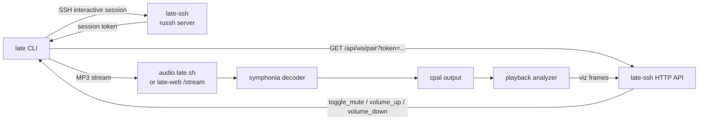

# late-cli Context

## Metadata
- Domain: `late-cli` - companion CLI for late.sh
- Primary audience: LLM agents working on the CLI, human contributors
- Last updated: 2026-06-04 (macOS native voice avoids LiveKit/WebRTC ObjC video factory crash path)
- Status: Active
- Stability note: Sections marked `[STABLE]` should change rarely. Sections marked `[VOLATILE]` are expected to change often.

---

## 0. Context Maintenance Protocol (LLM-First) [STABLE]

This file is the working context for `late-cli`. The root project context lives in `../CONTEXT.md`.

- Update this file whenever CLI behavior, protocols, flags, installer behavior, or audio/SSH invariants change.
- If code and this file diverge, prefer updating this file quickly so future work stays reliable.
- Keep root `CONTEXT.md` limited to project-wide contracts and pointers; put CLI-specific detail here.

### Quick update checklist
- Refresh `Last updated`
- Validate SSH mode, token-handshake, audio, and WebSocket pairing invariants
- Update CLI flags/env vars when `config.rs` changes
- Update installer/distribution notes when `scripts/install.*` or `.github/workflows/deploy_cli.yml` changes
- Remove obsolete compatibility notes

---

## 1. Summary [STABLE]

`late-cli` builds the `late` companion binary. It launches an SSH TUI session, plays the Icecast MP3 stream locally, analyzes audible samples for the TUI visualizer, pairs with the active SSH session over `/api/ws/pair`, and provides the native LiveKit voice media runtime for late.sh voice rooms.

Primary responsibilities:
- Local SSH launcher for `late.sh`
- Local audio playback via `cpal`
- MP3 stream decoding via `symphonia`
- FFT visualizer frames sent to the SSH TUI over WebSocket
- Paired mute/volume controls received from the TUI
- LiveKit voice capture/playout for native desktop CLI users, controlled over the pair WebSocket
- Cross-platform installer targets for Linux, macOS, Windows, and Android/Termux

Highest-risk areas:
- SSH token handshake compatibility between client and server
- Paired-client WebSocket routing/state drift
- Audio backend/device differences, especially sample-rate fallback and WSL
- LiveKit/WebRTC native audio runtime differences for voice on desktop platforms
- Terminal resize forwarding and pre-token input gating

`late-cli` intentionally has no `late-core` dependency.

---

## 2. Architecture [STABLE]



Runtime flow:
1. Resolve config from env and CLI args.
2. Resolve/generate SSH identity unless OpenSSH mode is allowed to use normal OpenSSH discovery.
3. Start local audio and analyzer, except OpenSSH mode which authenticates and fetches the token before audio starts.
4. Fetch a session token through the selected SSH transport.
5. Open the real SSH TUI session, except old/native modes where the interactive channel/process is already running with input gated.
6. Connect `/api/ws/pair?token=...` and send visualizer frames plus client state.
7. Apply paired control messages by muting/unmuting or changing local volume.

OpenSSH mode differs slightly: it authenticates and fetches the token first through a ControlMaster, starts audio and WebSocket pairing, then opens the interactive shell through the same master connection.

---

## 3. Entry Points and Files [STABLE]

- `src/main.rs` - top-level orchestration, mode split, audio/WS lifecycle
- `src/clipboard.rs` - paired `/paste-image` clipboard read, Wayland/X clipboard backend use, PNG encoding, and local size guards. Clipboard support is only advertised on Linux, macOS, and Windows; Android/Termux builds do not depend on `arboard`.
- `src/config.rs` - flags, env vars, defaults, logging
- `src/identity.rs` - dedicated key discovery/generation
- `src/ssh.rs` - native SSH, OpenSSH ControlMaster mode, legacy PTY subprocess mode, token parsing, resize forwarding
- `src/pty.rs` - terminal size/PTY helpers
- `src/raw_mode.rs` - local raw-mode guard for modes where CLI owns terminal forwarding
- `src/ws.rs` - paired-client WebSocket protocol, control handling, client state
- `src/voice.rs` - LiveKit voice-room media runtime; see `../late-ssh/src/app/voice/CONTEXT.md` for full voice protocol and invariants
- `src/audio/` - stream probing, decoding, playback queue, resampling, analyzer
- `build.rs` / `macos/Info.plist` - macOS-only linker metadata for the `late` binary, including `NSMicrophoneUsageDescription` required before LiveKit can open the microphone
- `Cargo.toml` - crate metadata; `otel` feature currently exists but is empty and default features are empty
- `README.md` - user-facing CLI docs
- `../scripts/install.sh` and `../scripts/install.ps1` - public installers
- `../scripts/run_local_cli*.sh`, `../scripts/run_prod_cli*.sh`, and PowerShell variants - repo helper launchers
- `../.github/workflows/deploy_cli.yml` - release artifact build/publish workflow

---

## 4. Config and Env Vars [STABLE]

Defaults in `src/config.rs`:
- `--ssh-target` / `LATE_SSH_TARGET`: default `late.sh`
- `--ssh-port` / `LATE_SSH_PORT`: optional
- `--ssh-user` / `LATE_SSH_USER`: optional
- `--key`, `--identity-file` / `LATE_KEY_FILE` / legacy `LATE_IDENTITY_FILE`: optional identity override
- `--ssh-mode` / `LATE_SSH_MODE`: `native` default; also `openssh` or `old`
- `--ssh-bin` / `LATE_SSH_BIN`: default `ssh`; parsed with shell-like quoting for OpenSSH/old modes
- `--audio-base-url` / `LATE_AUDIO_BASE_URL`: default `https://audio.late.sh`
- `--audio-output-device` / `LATE_AUDIO_OUTPUT_DEVICE`: optional exact CPAL output device name. When unset, the CLI uses the system default output device.
- `--api-base-url` / `LATE_API_BASE_URL`: default `https://api.late.sh`
- `LATE_LOG_FILE`: optional parent CLI tracing log path override. Default is `$XDG_STATE_HOME/late/late.log`, `~/.local/state/late/late.log`, or platform temp fallback.
- `LATE_LOG_STDERR=1`: force parent CLI tracing to stderr. Without this, an interactive `late --verbose` writes tracing to the log file so logs do not corrupt the SSH TUI. If stderr is already redirected, tracing writes to stderr for compatibility with `late -v 2>late-debug.log`.
- `LATE_WEBVIEW_LOG`: optional embedded YouTube helper stderr log path override. Default is `$XDG_STATE_HOME/late/webview.log`, `~/.local/state/late/webview.log`, or platform temp fallback.
- `LATE_WEBVIEW_DEBUG_STDERR=1`: inherit the embedded YouTube helper's stderr instead of redirecting it to the helper log file. Useful with `late -v 2>late-debug.log` when diagnosing GTK/WebKit/GStreamer startup.
- The parent starts the embedded YouTube helper with `NO_AT_BRIDGE=1` to opt the helper out of the AT-SPI accessibility bridge. This avoids host `libatk-bridge-2.0` crashes caused by stale `at-spi-bus-launcher`/dbus state while keeping the setting scoped to the helper process. On Linux it also sets `WEBKIT_DISABLE_DMABUF_RENDERER=1` by default if the caller did not set that variable, matching the common Arch/Wayland workaround for WebKitGTK DMABUF renderer failures.
- `-v`, `--verbose`: enables debug logging when `RUST_LOG` is not set

Logging:
- Without `RUST_LOG` and without `--verbose`, tracing output is disabled.
- With `--verbose` and no `RUST_LOG`, the filter is `warn,symphonia=error,late=debug`.
- If `RUST_LOG` is set, it wins through `tracing_subscriber::EnvFilter`.
- In an interactive terminal, enabled tracing goes to `LATE_LOG_FILE`/the default CLI log path and startup prints that path once before the TUI takes over. Set `LATE_LOG_STDERR=1` for old stderr behavior.
- `main()` installs Rustls' `ring` crypto provider before any config, HTTP, WebSocket, or LiveKit setup. This is required because the CLI dependency graph can contain both Rustls providers (`aws-lc-rs` from `reqwest` defaults and `ring` from LiveKit/WebSocket TLS), and Rustls panics if no process-level provider is selected explicitly.

Local helper scripts use local override env vars:
- `LATE_LOCAL_SSH_PORT`, falling back to `.env` `LATE_SSH_PORT` or `2222`
- `LATE_LOCAL_API_BASE_URL`, default `http://localhost:${LATE_API_PORT:-4000}`
- `LATE_LOCAL_AUDIO_BASE_URL`, default `http://localhost:${LATE_WEB_PORT:-3000}/stream`
- `LATE_LOCAL_SSH_TARGET`, default `localhost`
- `LATE_LOCAL_SSH_USER`, optional

Prod helper scripts use:
- `LATE_PROD_SSH_TARGET`, default `late.sh`
- `LATE_PROD_API_BASE_URL`, default `https://api.late.sh`
- `LATE_PROD_AUDIO_BASE_URL`, default `https://audio.late.sh`
- `LATE_PROD_SSH_PORT`, optional
- `LATE_PROD_SSH_USER`, optional

---

## 5. SSH Modes, Identity, and Token Handshake [STABLE]

### Native mode

`--ssh-mode native` is the default. It uses embedded `russh`, does not require `ssh` on `PATH`, verifies server keys against `~/.ssh/known_hosts`, and learns first-seen keys with accept-new semantics.

Native mode uses a dedicated SSH exec request:

```text
late-cli-token-v1
```

The server must return JSON:

```json
{ "session_token": "..." }
```

After the token is received, native mode opens the interactive SSH channel. There is no fallback to the legacy `LATE_SESSION_TOKEN=` banner protocol.

Native target parsing supports `user@host:port` and bracketed IPv6. If no user is supplied, it falls back to `USER`, then `USERNAME`, then `late`.

### OpenSSH mode

`--ssh-mode openssh` is for OpenSSH-managed auth flows, especially YubiKey/FIDO identities. It is Unix-only.

Behavior:
- Starts a private OpenSSH ControlMaster with `StrictHostKeyChecking=accept-new`
- Allows OpenSSH to own terminal prompts for PIN/passphrase/touch/agent/config handling
- Fetches the token with `late-cli-token-v1` over the control socket using `BatchMode=yes`
- Opens the interactive shell through the same control socket with `BatchMode=yes -tt`
- Cleans up the control socket directory on close/drop

If no explicit key is supplied, OpenSSH mode lets OpenSSH use normal `~/.ssh/config`, agent, and default identity discovery.

### Old subprocess mode

`--ssh-mode old` keeps the legacy OpenSSH-through-PTY path. It starts a system `ssh` client, sends `LATE_CLI_MODE=1`, and intercepts this one-line banner from the PTY stream:

```text
LATE_SESSION_TOKEN=<base64url-uuid-v7>
```

This mode remains a compatibility fallback.

Server tokens are compact URL-safe base64 UUIDv7 strings. Current tokens are 22 characters.

### Identity rules

- Default dedicated key path: `~/.ssh/id_late_sh_ed25519`
- `--key` / `LATE_KEY_FILE` override the path
- `LATE_IDENTITY_FILE` remains a legacy env fallback
- If the selected key path does not exist and stdin/stdout are interactive, the CLI offers to generate an Ed25519 key natively
- If the selected key path does not exist in a non-interactive terminal, the CLI fails with an explicit message
- On Unix, generated directories/files are chmod'd toward `0700` and `0600`
- Home lookup order is `HOME`, then `USERPROFILE`, then `HOMEDRIVE` + `HOMEPATH`

### Input gating invariant

In modes where the CLI owns input forwarding (`native` and `old`), stdin must stay blocked until the token phase completes. Keys typed during handshake/welcome race windows are intentionally discarded, then pending terminal input is flushed immediately before forwarding starts.

OpenSSH mode is the exception because system OpenSSH owns terminal input during auth and opens the interactive shell only after token acquisition.

---

## 6. Pairing Protocol [STABLE]

`late-cli` pairs to the active SSH session with:

```text
GET /api/ws/pair?token={token}
```

`--api-base-url` may be `http://`, `https://`, `ws://`, or `wss://`; `src/ws.rs` rewrites HTTP schemes to WebSocket schemes.

Client to server:

```json
{ "event": "heartbeat", "position_ms": 1234 }
```

```json
{ "event": "viz", "position_ms": 1234, "bands": [0.0, 0.0, 0.0, 0.0, 0.0, 0.0, 0.0, 0.0], "rms": 0.0 }
```

```json
{
  "event": "client_state",
  "client_kind": "cli",
  "ssh_mode": "native",
  "platform": "linux",
  "capabilities": ["clipboard_image"],
  "muted": false,
  "volume_percent": 30
}
```

Server to client:

```json
{ "event": "toggle_mute" }
```

```json
{ "event": "volume_up" }
```

```json
{ "event": "volume_down" }
```

```json
{ "event": "request_clipboard_image" }
```

Client to server, in response to `request_clipboard_image`:

```json
{ "event": "clipboard_image", "data_base64": "<base64 png bytes>" }
```

```json
{ "event": "clipboard_image_failed", "message": "clipboard does not contain an image" }
```

Client state labels:
- `ssh_mode`: `native`, `openssh`, `old`
- `platform`: `linux`, `macos`, `windows`, `android`, or `unknown`
- `capabilities`: optional list; Linux, macOS, and Windows desktop CLI builds advertise `clipboard_image`, `youtube`, and `voice`; Android/Termux builds leave it empty.

Pairing behavior:
- The server stores one paired-client sender/state entry per token.
- If multiple browser/CLI clients pair with the same token, latest registration owns control/state until it disconnects.
- CLI WebSocket reconnects up to 10 consecutive failures with a 2s delay.
- The pair WebSocket loop is selected alongside SSH session completion in the root async task, not spawned with `tokio::spawn`. This is intentional because native LiveKit voice room state is not `Send` on every desktop platform, notably macOS.
- The first `client_state` is sent immediately after connect, then sent again after any applied control message.
- `/paste-image` in SSH chat depends on the paired CLI control channel. The server only sends `request_clipboard_image` after seeing `clipboard_image` in the latest paired client's `client_state.capabilities`, so older CLIs and browser pairs do not receive unsupported control events.
- Linux Wayland support for `/paste-image` depends on the workspace `arboard` dependency enabling `wayland-data-control`; Hyprland uses this path. Without it, the CLI may report that the clipboard does not contain an image even when Wayland has `image/png` content.
- Clipboard images are converted to PNG in the CLI before upload. The CLI rejects zero-size images, very large decoded RGBA buffers, and PNG payloads above the upload cap before sending them over the pair socket.

Embedded YouTube helper window:
- `late webview-pair` opens a small 480x320 non-resizable, undecorated webview window only while the user source is YouTube and no real browser connect page is paired.
- The helper page is served from a loopback listener but loaded as `http://localhost:<port>/`, sends `Referrer-Policy: strict-origin-when-cross-origin`, and passes `window.location.origin` as the YouTube IFrame `origin`.
- By default the parent redirects helper stderr to the webview log path. For a single combined debug capture, run `LATE_WEBVIEW_DEBUG_STDERR=1 late -v 2>late-debug.log`; this captures both parent CLI tracing and helper GTK/WebKit/GStreamer output.
- The normal helper spawn sets `NO_AT_BRIDGE=1` and, on Linux, sets `WEBKIT_DISABLE_DMABUF_RENDERER=1` unless the user already set it. If `late webview-spike ...` is run directly during debugging and crashes in `libatk-bridge-2.0.so` after `dbind-WARNING`, retry as `NO_AT_BRIDGE=1 late webview-spike <video_id>` or restart stale `at-spi-bus-launcher` processes.
- If the embedded helper exits or fails to start 3 times within 60 seconds, the parent disables embedded YouTube fallback for 5 minutes and logs the helper log path. This prevents the repeated open/close loop when a host WebKit/GStreamer install is broken; a real browser connect page can still take over YouTube playback.
- The helper requests no initial focus and always-on-bottom placement; on Linux it also skips the taskbar. These are best-effort window-manager hints, not a hidden/background player. On Linux/Wayland the app id/class is `sh.late.youtube`; Hyprland may ignore always-on-bottom, so users who need stronger routing should use a special workspace/scratchpad instead of relying on fully off-screen placement.
- On initial helper open only, `webview-pair` uses the first `queue_update.current.started_at_ms` snapshot to apply one `startSeconds` value to the first matching `load_video`. If a `load_video` arrives before that first snapshot, the relay buffers it and flushes it when the snapshot decision is known. After that first load is dispatched, heartbeats and later track switches do not receive a seek offset and continue through the normal `loadVideoById({ videoId })` path.
- The helper page suppresses transient YouTube IFrame `unstarted`/`cued` states and only reports `ended` after the current item has reached `playing`; the server still owns queue advancement through its playback timer.
- If YouTube rejects the embedded iframe with `101`, `150`, or `153`, the helper logs the rejection and stays on its controlled bridge page. It does not navigate to the normal `youtube.com/watch` page because that would leave the local player bridge and make source switching/state harder to reason about.

---

## 7. Audio Runtime [STABLE]

`late-cli` opens the audio stream once and uses one decoded path for both playback and visualization.

Audio path:
1. Probe the MP3 stream with `SymphoniaStreamDecoder`.
2. Choose the output sample rate from the configured `cpal` output device, or the system default when no device name is configured.
3. Prefer the stream's native `44.1 kHz` when supported.
4. If the device requires another rate, such as `48 kHz`, resample locally with streaming linear resampling.
5. Decode frames into a lock-free SPSC playback ring buffer.
6. The output callback applies mute/volume and records post-mute/post-volume samples into the played ring.
7. The analyzer reads from the played ring and broadcasts `VizSample { bands: [f32; 8], rms }`.

Critical audio invariant:
- The analyzer must follow audible output, not raw decoded samples. Muting or lowering volume should visibly affect the TUI visualizer.
- The CPAL output callback must not take a mutex or allocate per output frame. Keep decoder-to-output transport on a lock-free SPSC ring and map channels directly into the callback buffer.
- Reuse Symphonia `SampleBuffer` storage across decoded packets; do not allocate a fresh conversion buffer per packet.

Platform notes:
- Android/Termux currently disables local audio in the runtime and still allows the SSH/client path to proceed.
- WSL uses a dedicated audio profile: fixed 2048-frame CPAL buffer where possible, a short prebuffer before `stream.play()`, and fail-open startup. If local WSL audio cannot start, the CLI continues into SSH with audio disabled and points users to browser pairing or Windows-native `late.exe`.
- On non-WSL, non-Android platforms, audio startup failure aborts the CLI before the interactive SSH session proceeds.
- WSL startup failures include a targeted hint that checks `DISPLAY`, `WAYLAND_DISPLAY`, and `PULSE_SERVER`.
- A working configured or default local audio output device is required for full desktop CLI startup.
- MP3 is the only enabled stream format.
- Stream URL normalization trims `/stream` and appends `/stream`.
- Stream probing scans up to 64 KiB for MP3 sync/ID3 before probing.
- Initial volume is 30%, mute starts false, and volume uses squared scaling.
- The playback queue caps at roughly two seconds of output samples.
- Analyzer cadence is about 15 Hz with a 1024-sample FFT and 8 log-spaced bands.

Audio and stream resiliency:
- WebSocket pairing has a 10-attempt retry loop with 2s delay.
- Startup stream probing and the decoder thread's first stream open each retry 3 times with a short 750ms delay before aborting startup. This covers rare Icecast/network timing blips where the first CLI launch says "failed to create audio decoder" but immediately joining again works.
- Decoder recovery re-probes `SymphoniaStreamDecoder` in place after stream failures, sleeps 2s between reconnects, and gives up after 10 consecutive failures.
- Browser and CLI visualizers share schema, not implementation. Browser uses Web Audio `AnalyserNode`; CLI uses Rust FFT over local playback samples. Similar behavior is expected, identical numbers are not.

---

## 8. Terminal and Resize Handling [STABLE]

Resize behavior:
- Native mode sends SSH `window-change` requests over the `russh` channel.
- Old mode resizes the local PTY attached to the system `ssh` process.
- OpenSSH mode delegates resize handling to the system `ssh` client.
- On Unix, resize forwarding follows `SIGWINCH`.
- On non-Unix native mode, resize forwarding polls terminal size changes every 250ms.
- Default terminal size fallback is `80x24`.

The CLI binary must forward local terminal resizes so side-by-side panes and split windows reflow after startup.

Raw mode:
- Native and old modes enable CLI raw mode.
- OpenSSH mode leaves raw mode to system OpenSSH so auth prompts retain normal terminal behavior.
- On macOS, native voice microphone access depends on the `late` Mach-O embedding `NSMicrophoneUsageDescription` from `macos/Info.plist`. Without it, macOS can abort the process on first microphone access; because abort bypasses `RawModeGuard::drop`, the terminal can remain in raw mode and the privacy exception prints as one long line.
- macOS voice uses the repo-local `webrtc-sys` patch in `vendor/webrtc-sys`, which disables LiveKit/WebRTC's ObjC video encoder/decoder factory registration for macOS builds. The CLI voice path is audio-only; avoiding the ObjC video factory prevents Tahoe/Apple Silicon `RTCVideoEncoderVP9` `NSException` crashes during peer-connection setup while keeping native voice advertised.
- On Windows native mode, the CLI must enable virtual-terminal/ANSI output before forwarding remote SSH bytes and virtual-terminal input before forwarding local stdin bytes. The server sends alt-screen, mouse, bracketed-paste, OSC, color, and cursor sequences as raw bytes; PowerShell/conhost sessions can print literal `ESC[` text unless `late.exe` flips the console output mode first. Arrow keys, Esc-prefixed keys, and similar special keys can fail to reach the remote TUI unless `late.exe` also enables VT input on the console input handle.
- Native mode forwards terminal capability env hints (`TERM_PROGRAM`, `LC_TERMINAL`, `TERM_FEATURES`, Kitty/WezTerm/Ghostty/Konsole vars, and Windows Terminal `WT_SESSION`/`WT_PROFILE_ID`) after PTY setup and before shell startup. `late-ssh` uses these hints to choose Kitty/iTerm2/Sixel image protocols when `TERM` alone is generic, which is especially important for Windows Terminal running PowerShell.

Shutdown invariant:
- Native mode treats SSH channel `EOF` the same as `Close` for interactive-session shutdown.
- Native and old modes must not run stdin forwarding in Tokio `spawn_blocking`: a thread blocked in `stdin.read()` cannot be aborted and can keep the runtime alive after the server has printed the farewell frame. Use a detached OS thread for stdin forwarding so process exit is controlled by the SSH completion task, not by the next local keypress.

---

## 9. Distribution [VOLATILE]

Public installers:
- macOS/Linux/Termux: `curl -fsSL https://cli.late.sh/install.sh | bash`
- Windows PowerShell: `irm https://cli.late.sh/install.ps1 | iex`
- Nix/NixOS: `nix run github:mpiorowski/late-sh#late`

Installer defaults:
- `scripts/install.sh` and `scripts/install.ps1` default to `https://cli.late.sh`
- `LATE_INSTALL_BASE_URL` overrides distribution host
- `LATE_INSTALL_VERSION` selects a specific version instead of `latest`
- `LATE_INSTALL_DIR` overrides install directory
- Shell installer detects WSL, Termux, and Git Bash/MSYS/Cygwin; Termux receives the Android build and Windows shell environments receive the Windows `late.exe` build
- Shell installer targets `/usr/local/bin`, `$HOME/.local/bin`, the Termux prefix, or `%LOCALAPPDATA%\Programs\late` under Windows shell environments, depending on platform and permissions
- PowerShell installer places `late.exe` under `%LOCALAPPDATA%\Programs\late` unless overridden and prints a PATH hint when needed
- PowerShell installer uses environment-based architecture detection instead of `RuntimeInformation.OSArchitecture` so older Windows PowerShell/.NET hosts can run it
- PowerShell installer passes `-UseBasicParsing` on download requests for Windows PowerShell 5.1 compatibility.
- Checksum verification runs when checksum download succeeds; checksum download failure is warning-only

Release workflow:
- `.github/workflows/deploy_cli.yml` builds `late-cli` release artifacts
- `deploy_cli.yml` triggers on published `*-cli` GitHub Releases and also supports manual `workflow_dispatch` with `release_tag` and `environment` inputs. Manual dispatch checks out the requested tag through the shared `source_ref` path and is the recovery path when GitHub misses a release event.
- Linux CI/release jobs install `libwebkit2gtk-4.1-dev` because the embedded YouTube webview compiles `wry`/WebKitGTK even when the normal terminal path is the primary runtime.
- Desktop release artifacts include native LiveKit voice media on Linux, macOS, and Windows. Keep macOS arm64 on `macos-15` or newer; the older `macos-14` image uses Xcode 15.4/libc++ and fails `webrtc-sys`'s C++20 `cxx` bridge range checks. Keep the macOS `late` binary linked with the embedded `macos/Info.plist` microphone usage string, or voice can abort on first microphone access. Keep Windows MSVC release builds on the static CRT (`crt-static`/`/MT`) because LiveKit's bundled WebRTC objects are built that way.
- Publishes versioned releases plus `latest`
- Publishes `install.sh` and `install.ps1` at the distribution root

Nix flake outputs:
- `packages.${system}.late` builds only the `late-cli` binary and sets `mainProgram = "late"`
- `apps.${system}.late` runs that CLI package for `nix run ...#late`
- `packages.${system}.late-sh` remains the default multi-binary package with `mainProgram = "late-ssh"`
- On Linux, the Nix package builds with WebKitGTK 4.1, GTK3, ALSA, glib-networking, and GStreamer base/good/bad/ugly/libav plugins. The installed `late` binary is wrapped with `GST_PLUGIN_SYSTEM_PATH_1_0` and `GIO_EXTRA_MODULES` so the embedded YouTube helper can find media plugins and GIO/TLS modules at runtime.
- On Linux, `default.nix` predeclares LiveKit's `webrtc-51ef663` WebRTC zip for x86_64/aarch64 and exports `LK_CUSTOM_WEBRTC` during the Cargo build. This keeps `webrtc-sys` from trying to download WebRTC from GitHub inside the Nix sandbox.

---

## 10. Testing and Command Policy [STABLE]

Inline unit tests in `late-cli/src/` should stay pure logic only:
- Config parsing and defaults
- SSH mode parsing
- `--ssh-bin` parsing
- WS URL construction
- WS control-message effects on mute/volume
- Playback position math
- Home directory and identity path logic
- Resampler/analyzer math where deterministic
- Token response parsing and command-spec construction

Do not put integration-flavored tests inside `#[cfg(test)]` modules if they require live SSH, WebSocket, audio devices, network, or async service orchestration.

LLM command policy from root context applies here:
- Agents must not run `cargo test`, `cargo nextest`, or `cargo clippy` in this repo.
- If a change would normally merit verification, note the expected command for the human owner instead of running it.
- `mix format` is irrelevant here; for Rust formatting, mention `cargo fmt --all -- --check` when handing off.

---

## 11. Runbook and Debugging [STABLE]

Common local commands:

```bash
scripts/run_local_cli_native.sh
scripts/run_local_cli.sh
scripts/run_prod_cli_native.sh
scripts/run_prod_cli.sh
```

Local end-to-end pairing needs:
- `late-ssh` API reachable, usually `localhost:4000`
- `late-ssh` SSH reachable, usually `localhost:2222`
- `late-web` stream proxy reachable, usually `localhost:3000/stream`
- Icecast/Liquidsoap stack serving `/stream`
- A usable configured or default audio output device unless running on Android

Troubleshooting:
- SSH will not connect: check `--ssh-target`, `--ssh-port`, selected SSH mode, key path, known-host trust, and whether `ssh late.sh` works directly.
- Native/OpenSSH token failure: verify the server supports `late-cli-token-v1`; native and OpenSSH modes intentionally do not fall back to the legacy banner.
- Old mode token failure: verify the server emits `LATE_SESSION_TOKEN=...` when `LATE_CLI_MODE=1` is sent.
- No audio: check local output device, `--audio-output-device` / `LATE_AUDIO_OUTPUT_DEVICE`, stream URL, Icecast/Liquidsoap health, and WSL audio env (`DISPLAY`, `WAYLAND_DISPLAY`, `PULSE_SERVER`).
- Visualizer not updating: check token match, `/api/ws/pair` reachability, WebSocket scheme rewriting, and whether analyzer frames are being produced from post-output samples.
- TUI volume keys do nothing: ensure the CLI is the latest paired client for that session token and is sending `client_state`.

Relevant TUI controls:
- `m`: toggle mute on paired client
- `+` / `=`: volume up on paired client
- `-` / `_`: volume down on paired client
- `P`: Home combined install + pair modal, with curl, Nix, build-from-source options and browser pairing QR/link

---

## 12. Current Known Gaps [VOLATILE]

- CLI startup still depends on a working configured or default local audio output device for full desktop audio.
- On non-WSL, non-Android platforms, audio startup failure prevents the interactive SSH session from proceeding.
- OpenSSH mode is Unix-only; Windows users should use native mode.
- Old mode remains as a compatibility path and still depends on system OpenSSH plus PTY behavior.
- Native mode does not handle OpenSSH/FIDO/YubiKey auth flows; users must switch to OpenSSH mode for those.
- Browser and CLI analyzers are intentionally not numerically identical.
- `scripts/run_local_cli.sh` checks for `script` but does not use it.
